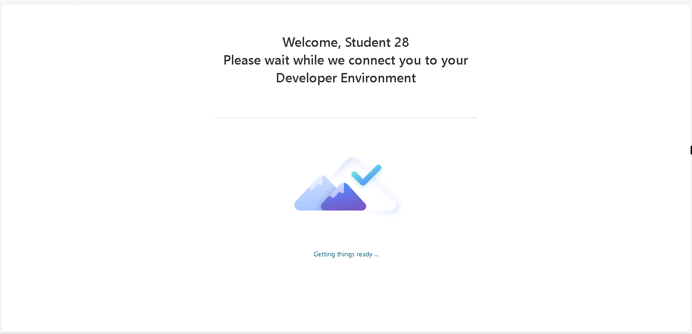

# 1 - Build your agent

To start, you're going to setup the foundation for your agent in Copilot Studio.

1. Open Microsoft Edge and navigate to

    <!-- markdownlint-disable-next-line MD034 -->
    +++https://copilotstudio.microsoft.com+++

    

1. Log in with

    <!-- markdownlint-disable-next-line MD034 -->
    **Username:** +++@lab.CloudCredential(CSBatch1).Username+++

    <!-- markdownlint-disable-next-line MD034 -->
    **Password:** +++@lab.CloudCredential(CSBatch1).Password+++

1. Select **Next** at the *Let's keep your account secure* screen

1. On the *Install Microsoft Authenticator* page, select **Setup a different authenticator** app

    

1. On the *Set up your account in app* page, select **Next**

1. Open the *Contoso Authenticator App* by selecting it on your desktop or on the task bar

    

1. If necessary, move the App to ensure that the QR Code is fully visible on the screen

1. Select the **Scan QR from Screen** button and then **copy** the available 6-digit code

    

1. Select **OK** in the *Copied - OTP copied to clipboard* page

1. On the web page, select **Next** and then paste the 6-digit code

    

1. On the *Authenticator app added* page, select **Done**

1. On the *Stay signed in* page, select **Yes**

1. After logging in, you'll see a message letting you know it's configuring your developer environment. Wait until that finishes (shouldn't take more than a minute)

    

1. If you see a welcome screen like is shown below, select the country/region that you’re in from the dropdown and select **Get Started**

    

1. If you see a welcome message as shown in the screenshot below, select **Skip**.

    

1. In the left nav click **+ Create** button to start creating a new agent

    

1. Click **New agent**

    

    > [!NOTE]
    > It could take a minute or two for the agent to fully configure. You'll see a message that says your agent is provisioned when it's ready.

1. When the agent is provisioned, select **Edit** in the details card

1. Name your agent +++Zava Order Support+++ and select **Save**

1. Now, you need to equip it with knowledge so it can answer questions about the company, shipping policies, etc. To do this, scroll down to the knowledge section and select the **Add Knowledge** tab.

    

1. Click the **select to browse** button and navigate to **D:\LabFiles\KnowledgeDocuments**. Select the **zava_faq** and **zava_returns_shipping_policy documents**.

    

1. Verify the files are added and select **Add to Agent**

    

1. You'll know your files are ready to use when you see the **Ready** checkbox next to each file.

    

    > [!NOTE]
    > The process of uploading the files can take around 5 minutes to complete. You can continue on to the next steps while the files are processing.

1. Now we need to tell the agent what it's supposed to do. To do this, scroll up to the **Instructions** section and select the **Edit** button and paste in the following instructions:

    ```text
    Your job is to help customers with Zava’s policies, product FAQs, shipping, returns, and general company info. Use only the supplied knowledge documents. Your behavior: Always consult the Knowledge sources (FAQ, Returns & Shipping Policy) for answers to customer questions in those domains. When you answer, provide a citation (which document and section) whenever possible. If the user asks about something not in the knowledge bases, reply with: "I'm sorry, I don't have that info yet. Can I help with something in our policy or FAQ?". Use a friendly, professional tone. Be clear but avoid any technical jargon unless user knows them. Keep answers focused and concise. Break up longer responses with bullet lists or numbered steps if helpful.
    ```

    Click **Save**

    

1. Before we test to make sure the agent is following our instructions and pulling from our knowledge sources, we need to configure some settings. To do this, select the **Settings** button in the upper right hand corner.

    

1. Scroll down toward the bottom of the page to find the **Knowledge** section. The default behavior for all agents created in Copilot Studio is to allow the agent to use general knowledge from the model that it is using, which in our case is the GPT 4.1 default model. While this is great if you want your agent to be able to handle chit-chat type scenarios, if you only want your agent to use the knowledge sources and tools you provide it with to answer questions, having this setting on could potentially lead to hallucinations. So, depending on your use case, you might want to disable this setting. Since we want our agent to only use data from the knowledge sources we provide to answer questions, we will toggle the **Use general knowledge** setting to **Off**.

    

1. Click the **Save** button at the bottom of the screen and select the **X** button in the upper right hand corner to close out of the settings screen.

    

1. Now we need to test the agent. Ensure that the test panel is open on the right hand side of the page, type in the following and press **Enter**

    ```text
    What is your return policy?
    ```

    
  
    > [!NOTE]
    > Don't forget to check that your files have finished uploading and show Ready status before testing.

1. Review the output and notice the Activity Pane that displays on the left hand side showing where it pulled the answer from.

    

    > [!TIP]
    > Given the nature of generative AI, your answer might differ from the answer shown in the screenshot above. That's ok and expected. The important thing here is to observe the Activity Map and how you can tell the agent is pulling from your knowledge.

Congratulations! You have setup an agent that can answer questions about static data from files! Next ,we'll integrate it with an MCP server.
