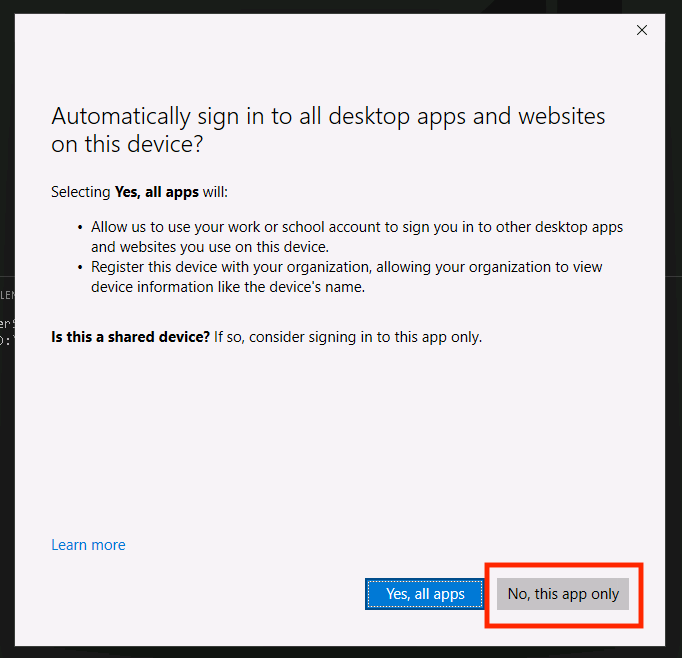

# 2 - Connect to an MCP Server

In this part, you will learn about how to run a Model Context Protocol (MCP) server and how to connect it to Microsoft Copilot Studio. Zava has created an MCP server for inventory management that provides tools for managing products (like get_products and add_product), stores (such as get_stores and add_store), and inventory operations (including list_inventory_by_store). The MCP server is available on **D:\LabFiles\ZavaInventoryMCP**.

## What is Model Context Protocol (MCP) and why are we using it?

Model Context Protocol (MCP) provides a way to let an AI agent safely use tools that live outside of Copilot Studio.

Instead of you telling the agent exactly *which* API to call and *when* to call it, MCP lets you describe **what the system can do**, and the agent figures out how to use those capabilities based on the user’s request.

You can think of an MCP server like a menu:

- It lists what actions are available (for example: get products, add a store, check inventory)
- Each action has a clear name and expected inputs
- The agent chooses the right action when it needs it

---

### Why not just use flows or custom connectors?

Traditional integrations usually require you to:

- Build a flow for each scenario
- Decide ahead of time which API is called
- Manually manage multi-step logic

With MCP, you don’t build a flow for every path.  
You expose **capabilities**, and the agent decides how to use them.

This means:

- Fewer flows to design and maintain
- Less hard-coded logic
- More flexible conversations

---

### Why MCP is a good fit for agents

Agents don’t just respond once, they can:

- Ask follow-up questions
- Decide what information is missing
- Call multiple tools to complete a task

MCP supports this by allowing the agent to:

- Discover available tools
- Call more than one tool if needed
- Use the results to decide the next step

In this lab, you’ll see the agent automatically:

- List stores
- Look up inventory
- Add new records

All without you building a flow or explicitly telling it each step.

That’s the main value MCP brings.

Now, onto the lab!

## Open the MCP Server in Visual Studio Code

1. Open Visual Studio Code by selecting Visual Studio Code in the taskbar
1. It should automatically have the Zava InventoryMCP Server Folder open. If you don't see the folder open, follow these steps to open the folder:
    1. Select **File > Open Folder**
    1. Navigate to **D:\LabFiles\ZavaInventoryMCP**
    1. Select **Select Folder**
    1. You might see a pop up where you will be asked to trust the authors of the files in this folder. Make sure to select **Yes, I trust the authors**
        

This will open the Zava Inventory Management MCP server in Visual Studio Code. Let's explore the MCP Server to see what files are in there.

## Explore the Zava Inventory Management MCP Server

The MCP server folder contains several key files that make up the MCP Server:

### Source files

Expand the **src** folder in the **Explorer** section on the left hand side and browse the source files.

- **src/server.py**: The main MCP server implementation with all tools for products, stores, and inventory
- **src/helpers.py**: Utility functions for data loading and JSON file operations
- **src/middleware.py**: Authentication middleware for API key validation
- **src/requirements.txt**: Python dependencies needed to run the server

### Data files

Expand the **Data** folder to see what's in this folder.

- **data/products.json**: Sample product data with products
- **data/stores.json**: Sample store data with store locations
- **data/inventory.json**: Sample inventory records with stock entries

These files are the sample “database” for the lab, the server reads and writes to them. Feel free to look around in these files to see what's going on in the server.

Now, let's install the dependencies so that we can run the server locally.

## Install dependencies

1. Open the terminal by selecting **Terminal > New Terminal**

    

1. Make sure you are in the following folder: **D:\LabFiles\ZavaInventoryMCP**

    

1. Create a new virtual environment by running the following command (press **Enter** after pasting in the terminal to run it):

    ```bash
    python -m venv .venv
    ```

1. Now, you need to activate the virtual environment. Run the following command to do that.

    ```bash
    .venv\Scripts\activate
    ```

1. Install all dependencies by running the command below. It might take a while, so wait a little while until it's finished.

    ```bash
    pip install -r src/requirements.txt
    ```

1. Your terminal should look something roughly like this once done with all the commands run so far.

    

## Run the MCP Server

1. Now it's time to run the MCP Server. Use the following command to start the Zava Inventory MCP Server.

    ```bash
    python src/server.py
    ```

    

After running the MCP Server, you're not there yet. The MCP Server is only running locally right now, so you need to make sure the MCP Server is available through a public URL. This is a requirement for Microsoft Copilot Studio. Because it's a cloud service, it's not able to reach your localhost.

## Configure a dev tunnel

To make sure we can reach the MCP Server from Microsoft Copilot Studio, we'll add a dev tunnel. During these steps, you will be prompted to log in. Use the Entra ID account from this workshop when you are prompted to log in.

> [!Note] A dev tunnel creates a secure connection that exposes your local development server to the internet through a public URL. This allows cloud services like Copilot Studio to access your locally running MCP server. We use this to test that the MCP Server is working but if you want to use this in production you would deploy the MCP server.

In the terminal at the bottom of Visual Studio Code, we are going to configure a dev tunnel.

1. Select the **+** in the top right corner of the terminal

    

    This will open a new terminal, so that we don't stop our running server.

1. Run the following command to login to the dev tunnel service

    ```bash
    devtunnel login
    ```

1. In the pop-up that will appear, select **Work or School account** and select **Continue**

    

1. Log in with:

    <!-- markdownlint-disable-next-line MD034 -->
    **Username:** +++@lab.CloudCredential(CSBatch1).Username+++

    <!-- markdownlint-disable-next-line MD034 -->
    **Password:** +++@lab.CloudCredential(CSBatch1).Password+++

    <!-- markdownlint-disable-next-line MD034 -->
    **Temporary Access Password:** +++@lab.Variable(TAP)+++

1. In the next screen where it asks if you want to automatically sign into all desktop apps on this device, select **No, this app only**

    

1. Run the following command to create the devtunnel:

    ```bash
    devtunnel create -a
    ```

<!-- markdownlint-disable-next-line MD033 -->
1. Run the following command to open port 3000 for the dev tunnel:

    ```bash
    devtunnel port create -p 3000
    ```

<!-- markdownlint-disable-next-line MD033 -->
1. Run the following command to host the dev tunnel:

    ```bash
    devtunnel host
    ```

    This will give you the following message:  

    <!-- markdownlint-disable-next-line MD033 -->
    Connect via browser: https<nolink>://x.devtunnels.ms:3000, https<nolink>:://x-3000.x.devtunnels.ms
    <!-- markdownlint-disable-next-line MD033 -->
    Inspect network activity: https<nolink>:://x-3000-inspect.x.devtunnels.ms
    Ready to accept connections for tunnel: x.x

    

    <!-- markdownlint-disable-next-line MD033 -->
    > [!Alert] It's very important to select the URL that looks like this: https<nolink>://x-3000.x.devtunnels.ms
    >
    > The other URL - with *:3000* in the URL - will give you errors later on.

1. Open the second URL after connect via browser by using **ctrl + click**

    You may see a **connection isn't private error**. If you do, select **Advanced** and click the **Continue** link

    

    Now your browser will be opened and you will see a warning like this:

    

1. Select **Continue**

    Now, the following message should be displayed:  

    The Zava Inventory 📦 MCP Server 🧠 is running

1. In the address bar, add `/mcp` behind the address and hit **Enter**

    Now your browser will display an error, because in the browser we didn't add the API Key.  
    🔒 Authentication Failed ⛔

We are going to fix this error in the next steps.

## Add the MCP Server in Microsoft Copilot Studio

1. Select Microsoft Edge to go back to your agent in Copilot Studio.

    

1. Select the **Tools** tab in the top navigation of your agent. If you don't see it, select the **+7** button in the navigation then select **Tools**.  DO NOT select the Tools option in the left navigation.

    

1. Select **+ Add a tool**

    

1. Select **+ New tool**

    

1. Select **Model Context Protocol**

    

1. Enter the **Name**:

    ```text
    Zava Inventory MCP
    ```

1. Enter the **Description**:

    ```text
    MCP server that provides tools for managing Zava's product inventory, store locations, and stock operations across multiple retail locations.
    ```

1. Enter the **Server URL**. This should be the URL you opened earlier during the devtunnel steps without the *https://* in front of it and with the */mcp* behind it. For example: *x-3000.x.devtunnels.ms/mcp*.
1. For *Authentication*, select **API key**
1. Leave the *type* on *Header* and for *Header name* add the following value:

    ```text
    authorization
    ```

    

1. Check if all the values are correct and if so, select **Create** to add the MCP Server

    This will take a while, since in the background it is creating a custom connector for the MCP Server.

1. When it's done, select **Not connected** and **Create new connection**

    

1. Enter the **API Key**:

      ```text
    AITour2026!
      ```

1. Select **Create**

    

1. Select **Add and configure**

    

    Now it's time to test the agent with the MCP Server!

1. Ensure the Test pane is open and enter the following message and send it in the *Test your agent* panel:

    ```text
    List the Zava Stores
    ```

    > [!NOTE]
    > The test pane is made to verify your agent is working from a user point of view. We added a connection when we added the MCP Server as a tool, but that one is not connected to the test pane yet.

1. Select the **Open connection manager** link

    

1. Next, in the *Manage your connections* screen, select **Connect** next to the *Zava Inventory MCP* tool

    

1. This should open the *Create or pick a connection* screen and it will automatically use the connection you created before. Select **Submit** to confirm the connection

    

1. Next you should see the *Manage your connections* screen again, but now the status should show *Connected*. Close the *Manage your connections* screen and go back to the *Test your agent* section

1. Select the **Retry** button

    

    After this, the agent should show you a whole bunch of Zava Stores as an answer in the *Test your agent* panel:

    

    And on the left in the *Activity map*, you can see that the Zava Inventory MCP has been initialized and the *get_stores* tool has been triggered by our message. When you click on the *get_stores* tool, you're even able to see the output that the agent got from the MCP server. This means our agent made that text into the formatted output we saw in the *Test your agent* panel.

    

    Let's experiment a bit more with the other tools as well.

1. Send the following message to your agent via the *Test your agent* panel:

    ```text
    List the available products in the Zava Amsterdam store
    ```

    You will see the available products in the Zava Amsterdam store in the *Test your agent* panel:

    

    Now you can see in the *Activity map* more tools have been triggered. The *get_stores* tool has been triggered again, because it needs it for the *list_inventory_by_store* tool. This really shows the power of MCP: when used correctly, it can do a lot of calls for you, without having to build a flow for it or to give it more instructions.

    

    But now - we only did get actions, wouldn't it be good to also add something?

1. Send the following message to your agent via the *Test your agent* panel:

    ```text
    Please add the following Zava Store:
    Zava Chicago
    1597 Virginia Street, Chicago, Illinois, IL 60618, US
    ```

    

    

    > [!NOTE]
    > You may get different results. For example, the agent might ask you for the city or country of the store. This means it wasn't able to get all the information from the message. If this happens, reply back with the information and it should continue adding the store.

This section was to help you understand how to use MCP in a Copilot Studio agent. If you have time left at the end of this workshop, feel free to play around with the other tools in the MCP Server.
