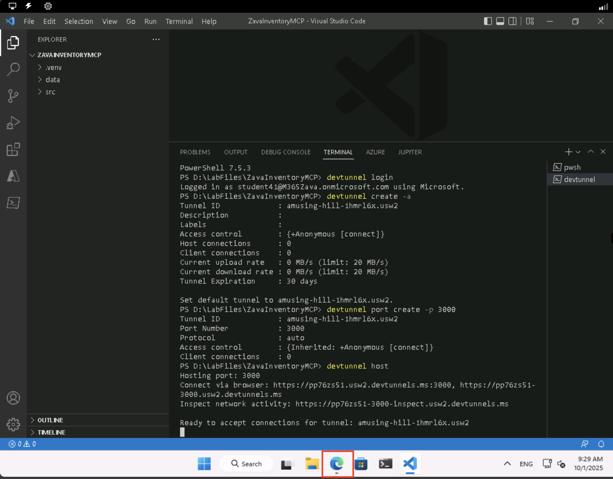
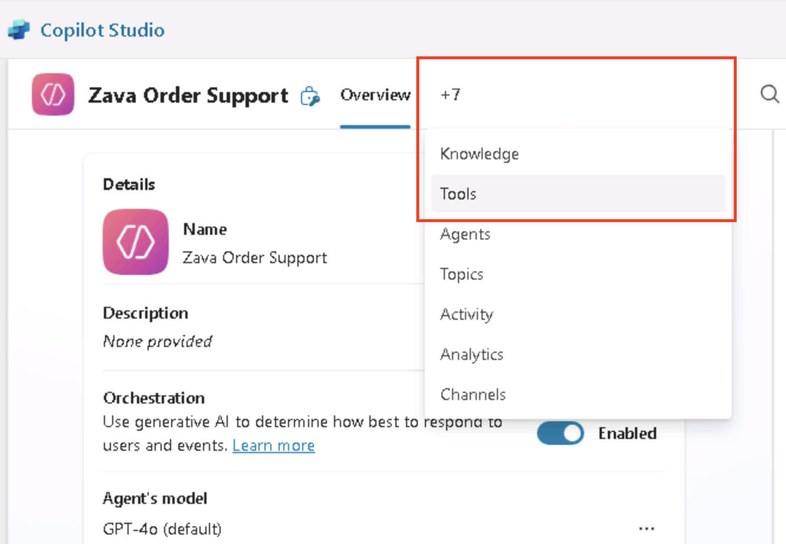
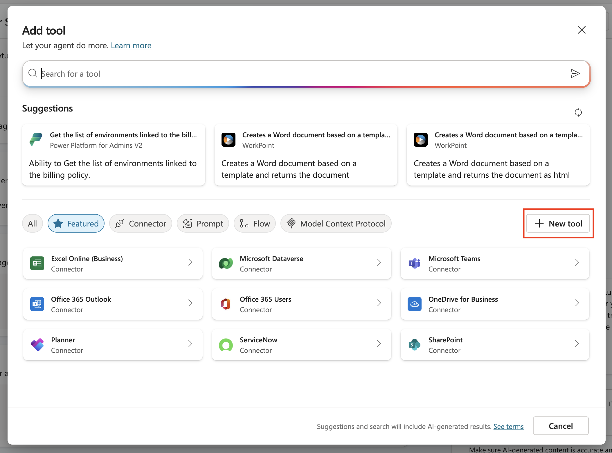
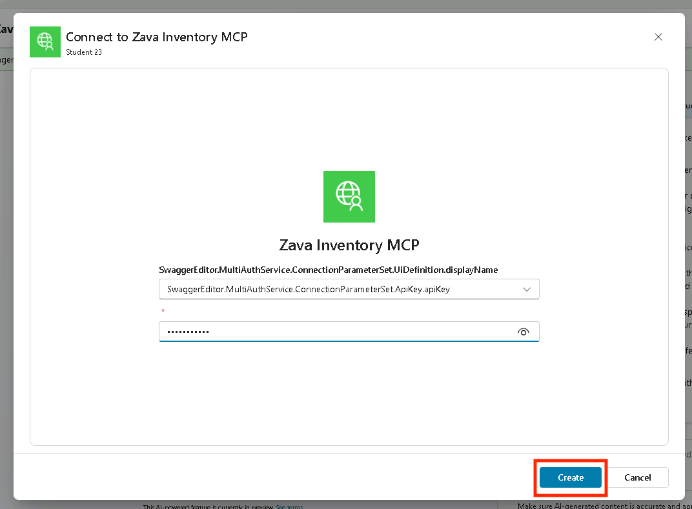

# 2 - Connect to an MCP Server

In this part, you will learn about how to run a Model Context Protocol (MCP) server and how to connect it to Microsoft Copilot Studio. Zava has created an MCP server for inventory management that provides tools for managing products (like get_products and add_product), stores (such as get_stores and add_store), and inventory operations (including list_inventory_by_store). The MCP server is available on **D:\LabFiles\ZavaInventoryMCP**.

## What is the benefit of an MCP Server?

Model Context Protocol (MCP) servers provide a standardized way to connect AI agents to various data sources and tools, offering several key benefits:

**Simplified Integration**: MCP servers act as a bridge between your AI agent and backend systems, eliminating the need to build custom integrations for each data source. Instead of creating multiple point-to-point connections, you can use a single protocol to access different systems.

**Reusability**: Once you create an MCP server, it can be used across multiple agents and applications. The Zava Inventory MCP server you'll work with in this lab can be shared with any agent that needs inventory management capabilities.

**Contextual Intelligence**: MCP servers provide structured access to relevant context and tools, allowing AI agents to make informed decisions and take actions. For example, the Zava Inventory MCP server provides tools for querying products, managing stores, and tracking inventory - giving the agent everything it needs to handle inventory-related tasks.

**Security and Control**: MCP servers can implement authentication and authorization, ensuring that agents only access data and perform actions they're permitted to. This centralized approach makes it easier to maintain security policies across your AI applications.

**Flexibility**: MCP servers can expose multiple tools and capabilities in one place. As you'll see, the Zava Inventory MCP server provides tools for products, stores, and inventory operations - all accessible through a single connection.

By using MCP servers, you can build more capable agents faster while maintaining better control over how they interact with your business systems.

## Open the MCP Server in Visual Studio Code

1. Open Visual Studio Code by selecting Visual Studio Code in the taskbar
1. It should automatically have the Zava InventoryMCP Server Folder open. If you don't see the folder open, follow these steps to open the folder:
    1. Select **File > Open Folder**
    1. Navigate to **D:\LabFiles\ZavaInventoryMCP**
    1. Select **Select Folder**
    1. You might see a pop up where you will be asked to trust the authors of the files in this folder. Make sure to select **Yes, I trust the authors**
        

This will open the Zava Inventory Management MCP server in Visual Studio Code. Let's explore the MCP Server to see what files are in there.

## Explore the Zava Inventory Management MCP Server

The MCP server folder contains several key files that make up the MCP Server:

### Source files

Expand the **src** folder in the **Explorer** section on the left hand side and browse the source files.

- **src/server.py**: The main MCP server implementation with all tools for products, stores, and inventory
- **src/helpers.py**: Utility functions for data loading and JSON file operations
- **src/middleware.py**: Authentication middleware for API key validation
- **src/requirements.txt**: Python dependencies needed to run the server

### Data files

Expand the **Data** folder to see what's in this folder.

- **data/products.json**: Sample product data with products
- **data/stores.json**: Sample store data with store locations
- **data/inventory.json**: Sample inventory records with stock entries

Make sure to look around in these files to see what's going on in the server. Now, let's install the dependencies so that we can run the server locally.

## Install dependencies

1. Open the terminal by selecting **Terminal > New Terminal**
1. Make sure you are in the following folder: **D:\LabFiles\ZavaInventoryMCP**
1. Create a new virtual environment by running the following command (press **Enter** after pasting in the terminal to run it):

    ```bash
    python -m venv .venv
    ```

1. Now, you need to activate the virtual environment. Run the following command to do that.

    ```bash
    .venv\Scripts\activate
    ```

1. Install all dependencies by running the command below. It might take a while, so wait a little while until it's finished.

    ```bash
    pip install -r src/requirements.txt
    ```

## Run the MCP Server

1. Now it's time to run the MCP Server. Use the following command to start the Zava Inventory MCP Server.

    ```bash
    python src/server.py
    ```

After running the MCP Server, you're not there yet. The MCP Server is only running locally right now, so you need to make sure the MCP Server is available through a public URL. This is a requirement for Microsoft Copilot Studio. Because it's a cloud service, it's not able to reach your localhost.

## Configure a dev tunnel

To make sure we can reach the MCP Server from Microsoft Copilot Studio, we'll add a dev tunnel. During these steps, you will be prompted to log in. Use the Entra ID account from this workshop when you are prompted to log in.

> [!Note] A dev tunnel creates a secure connection that exposes your local development server to the internet through a public URL. This allows cloud services like Copilot Studio to access your locally running MCP server. We use this to test that the MCP Server is working but if you want to use this in production you would deploy the MCP server.

In the terminal at the bottom of Visual Studio Code, we are going to configure a dev tunnel.

1. Select the **+** in the top right corner of the terminal

    

    This will open a new terminal, so that we don't stop our running server.

1. Run the following command to login to the dev tunnel service

    ```bash
    devtunnel login
    ```

1. In the pop-up that will appear, select **Work or School account** and select **Continue**

    

1. Log in with:

    <!-- markdownlint-disable-next-line MD034 -->
    **Username:** +++@lab.CloudCredential(CSBatch1).Username+++

    <!-- markdownlint-disable-next-line MD034 -->
    **Password:** +++@lab.CloudCredential(CSBatch1).Password+++

1. In the next screen where it asks if you want to automatically sign into all desktop apps on this device, select **No, this app only**

    

1. Run the following command to create the devtunnel:

    ```bash
    devtunnel create -a
    ```

<!-- markdownlint-disable-next-line MD033 -->
1. Run the following command to open port 3000 for the dev tunnel:

    ```bash
    devtunnel port create -p 3000
    ```

<!-- markdownlint-disable-next-line MD033 -->
1. Run the following command to host the dev tunnel:

    ```bash
    devtunnel host
    ```

    This will give you the following message:  

    > [!NOTE]
    > Connect via browser: <https://x.devtunnels.ms:3000>, <https://x-3000.x.devtunnels.ms>
    >
    > Inspect network activity: <https://x-3000-inspect.x.devtunnels.ms>
    > Ready to accept connections for tunnel: x.x

    

    <!-- markdownlint-disable-next-line MD033 -->
    > [!Alert] It's very important to select the URL that looks like this: https<nolink>://x-3000.x.devtunnels.ms
    >
    > DO NOT USE the other URL (with *:3000* in the URL) will give you errors later on.

1. Open the second URL after connect via browser by using **ctrl + click**

    Now your browser will be opened and you will see a warning like this:

    

1. Select **Continue**

    Now, the following message should be displayed:  

    The Zava Inventory 📦 MCP Server 🧠 is running

1. In the address bar, add `/mcp` behind the address and hit **Enter**

    Now your browser will display an error, because in the browser we didn't add the API Key.  
    🔒 Authentication Failed ⛔

We are going to fix this error in the next steps.

## Add the MCP Server in Microsoft Copilot Studio

1. Select Microsoft Edge to go back to your agent in Copilot Studio.

    

1. Select the **Tools** tab in the top navigation of your agent. If you don't see it, select the **+7** button in the navigation then select **Tools**.  DO NOT select the Tools option in the left navigation.

    

1. Select **+ Add a tool**

    

1. Select **+ New tool**

    

1. Select **Model Context Protocol**

    

1. Enter the **Name**:

    ```text
    Zava Inventory MCP
    ```

1. Enter the **Description**:

    ```text
    MCP server that provides tools for managing Zava's product inventory, store locations, and stock operations across multiple retail locations.
    ```

1. Enter the **Server URL**. This should be the URL you opened earlier during the devtunnel steps without the *https://* in front of it and with the */mcp* behind it. For example: *x-3000.x.devtunnels.ms/mcp*.
1. For *Authentication*, select **API key**
1. Leave the *type* on *Header* and for *Header name* add the following value:

    ```text
    authorization
    ```

    

1. Check if all the values are correct and if so, select **Create** to add the MCP Server

    This will take a while, since in the background it is creating a custom connector for the MCP Server.

1. When it's done, select **Not connected** and **Create new connection**

    

1. Enter the **API Key**:

      ```text
    AITour2026!
      ```

1. Select **Create**

    

1. Select **Add and configure**

    

    Now it's time to test the agent with the MCP Server!

1. Select the **Expand Test Pane** icon in the top right corner of the *Test your agent* panel. This will help you understand what is happening when you are sending and receiving messages in the *Test your agent* panel.

    

1. Now, enter the following message and send it in the *Test your agent* panel:

    ```text
    List the Zava Stores
    ```

    > [!NOTE]
    > The test pane is made to verify your agent is working from a user point of view. We added a connection when we added the MCP Server as a tool, but that one is not connected to the test pane yet.

1. Select the **Open connection manager** link

    

1. Next, in the *Manage your connections* screen, select **Connect** next to the *Zava Inventory MCP* tool

    

1. This should open the *Create or pick a connection* screen and it will automatically use the connection you created before. Select **Submit** to confirm the connection

    

1. Next you should see the *Manage your connections* screen again, but now the status should show *Connected*. Close the *Manage your connections* screen and go back to the *Test your agent* section

1. Select the **Retry** button

    

    After this, the agent should show you a whole bunch of Zava Stores as an answer in the *Test your agent* panel:

    

    And on the left in the *Test your agent* panel, you can see that the Zava Inventory MCP has been initialized and the *get_stores* tool has been triggered by our message. When you click on the *get_stores* tool, you're even able to see the output that the agent got from the MCP server. This means our agent made that text into the formatted output we saw in the *Test your agent* panel.

    

    Let's experiment a bit more with the other tools as well.

1. Send the following message to your agent via the *Test your agent* panel:

    ```text
    List the available products in the Zava Amsterdam store
    ```

    You will see the available products in the Zava Amsterdam store in the *Test your agent* panel:

    

    Now you can see in the *Test Panel* more tools have been triggered. The *get_stores* tool has been triggered again, because it needs it for the *list_inventory_by_store* tool. This really shows the power of MCP: when used correctly, it can do a lot of calls for you, without having to build a flow for it or to give it more instructions.

    

    But now - we only did get actions, wouldn't it be good to also add something?

1. Select the **New Test Session** button in the *Test your agent* panel:

    

1. After that, send the following message in the *Test your agent* panel:

    ```text
    Please add the following Zava Store:
    Zava San Francisco
    2481 Mission Terrace, San Francisco, CA 94131
    ```

    

    As you can see, we didn't add United States to the message, but it automatically added that based on the details in the message.

    

If you want to check if the store really got added, you can go back to Visual Studio Code and go to **Data** > **stores.json** and look at the bottom of that file. You should see the store there!


This section was to help you understand how to use MCP in a Copilot Studio agent. If you have time left at the end of this workshop, feel free to play around with the other tools in the MCP Server.
