# 3 - Add a Prompt for Warranty Claim Processing

Now that we’ve got an agent that can answer questions from knowledge and integrate with our MCP server for real time operations, we’ll give the agent additional capabilities by integrating an AI prompt to process warranty claims. In this section, we’ll add a Warranty Policy knowledge source (category-based rules), then use a single AI prompt to turn messy, pasted claim text into clean fields and even intelligently classify the claim.

1. In your agent overview screen (select the overview tab to get to it), scroll down to the Tools section and select **Add tool**

    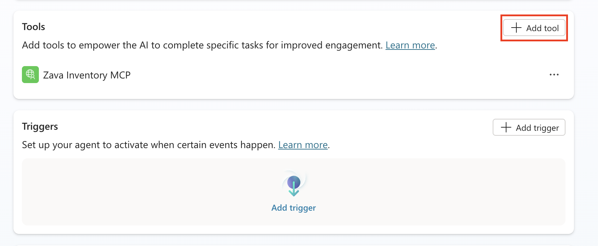

1. Select **Prompt** in the *Create new* section

    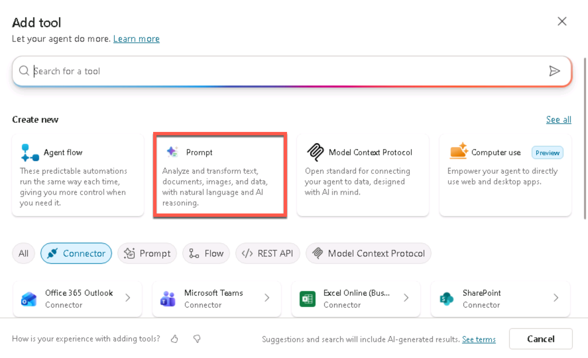

1. Click in the top bar next to the icon and rename the prompt to  ```Warranty Claim Processor```

    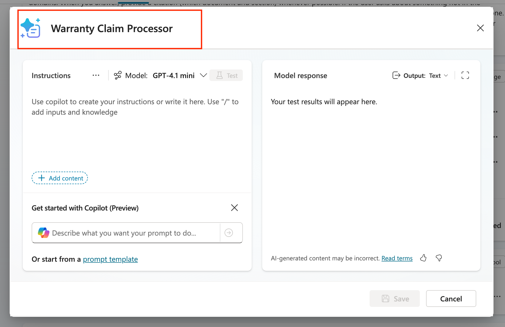

1. Paste the following instructions into the instructions panel of the prompt:

    ```text
    Review the [add input here] and extract this key information:
    Product Name
    SKU
    Purchase Date
    Order Number
    Claimant Name
    Product Category (Group into either Electronics, Furniture, Home & Garden, Sports & Fitness, Kitchen, Accessories)
    Issue Summary
    Issue Category (i.e., Physical Damage, Wear and Tear, Misuse, Dead On Arrival, Unknown)
    ```

    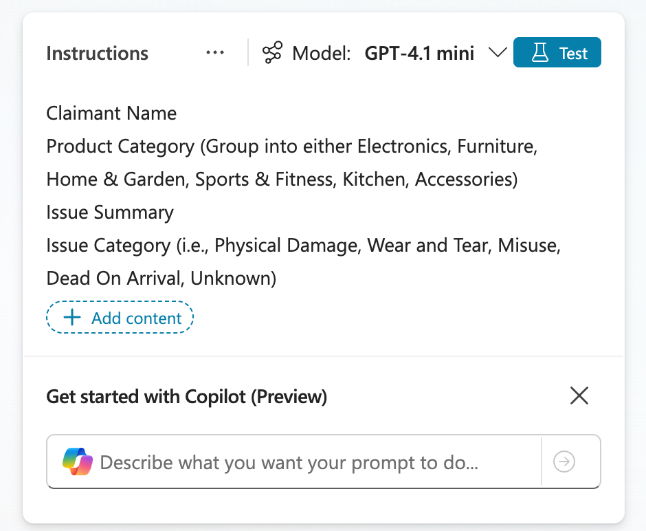

1. Delete the **[add input here]** text and type a **forward slash (/)** and select **text** to add a new variable

    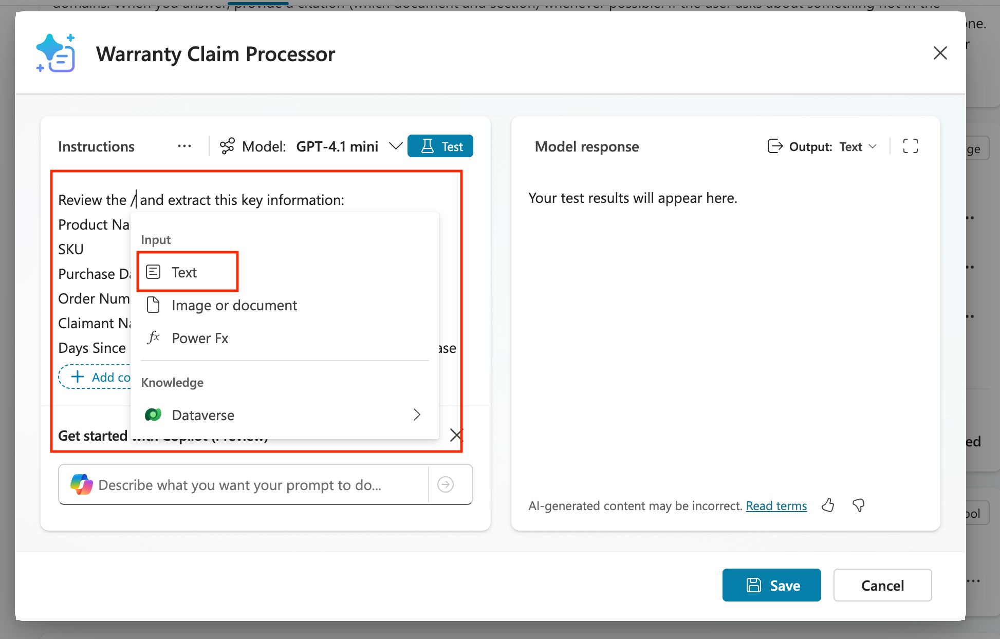

1. Name this variable ```Warranty Claim``` and put in the following text in the **Sample data** input:

    ```text
    Help me process this warranty claim from this customer: Alex Morgan (alex.morgan@example.com, +1 (555) 012-7784, prefers email). Address: 123 Maple Lane, Tulsa, OK 74104. Product is a Zava Backpack (SKU BP-010) purchased from Zava Online on 2025-08-22, order A12876. After two commutes the main zipper pull detached; the teeth misaligned and the main compartment won’t close—used under normal conditions. Please evaluate against our warranty policy and advise approval/denial and next steps (including RMA if applicable).
    ```

    Select the **close button**

    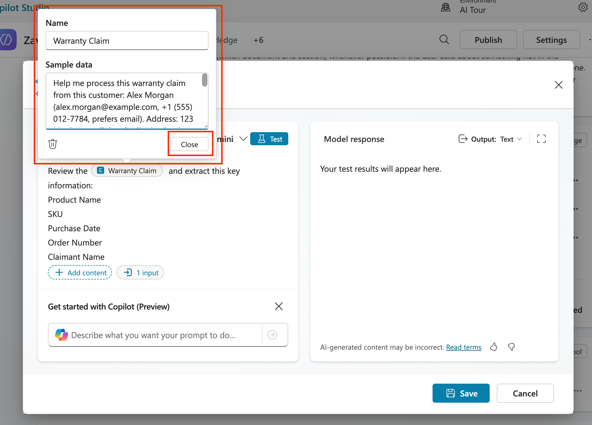

1. Select the **Output** dropdown and change it to **JSON** so we can get a structured response.

    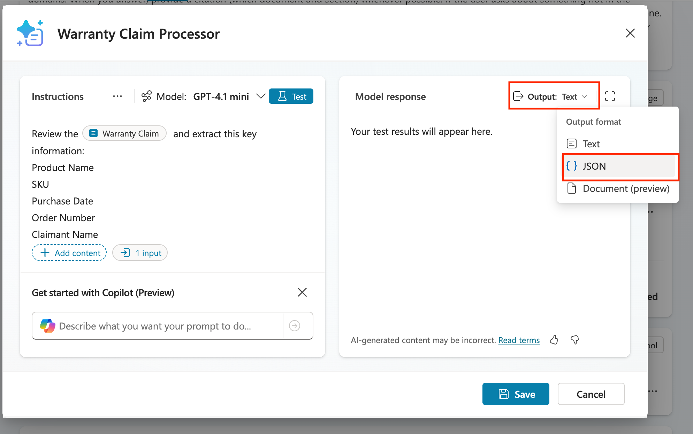

1. Before saving, we have to test to make sure the prompt works correctly, that is why we put sample data in our input in the previous step. To do that, click the **Test** button.

    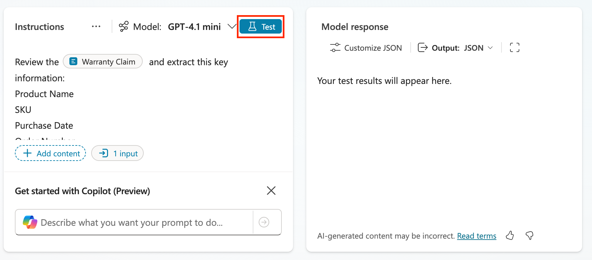

1. Review the output of the test and notice how it extracted all the info in a structured format. Click the **Save** button to save this new prompt.

    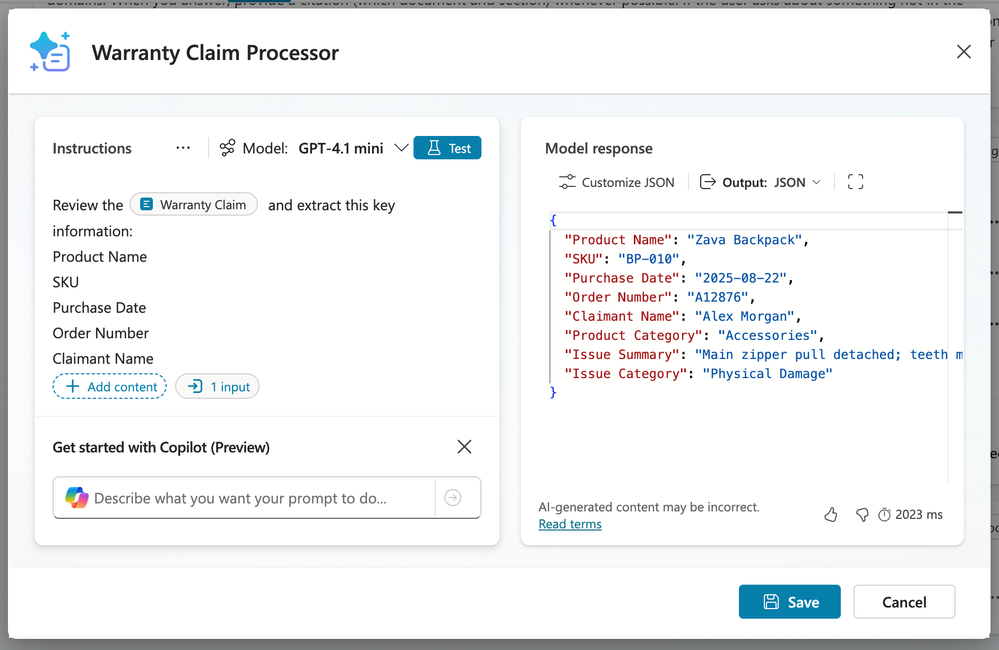

1. Now click the **Add and configure** button to add this to the agent and take you directly to the configuration page for the prompt.

    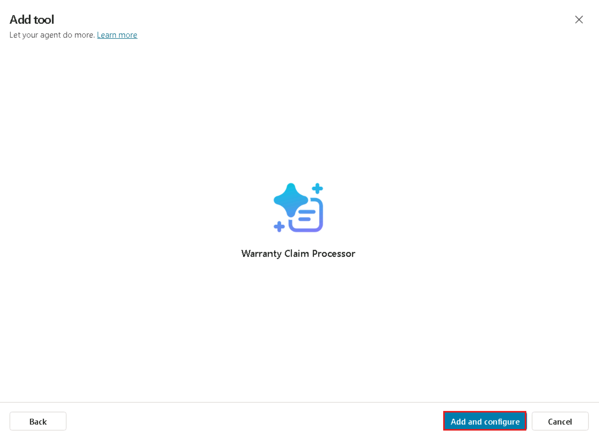

1. Now we'll see the configuration screen where we can control specific settings for the prompt for use in our agent. The first thing we need to do is expand out the **Additional details** section and select the **Agent may use this tool at any time** radio button.

    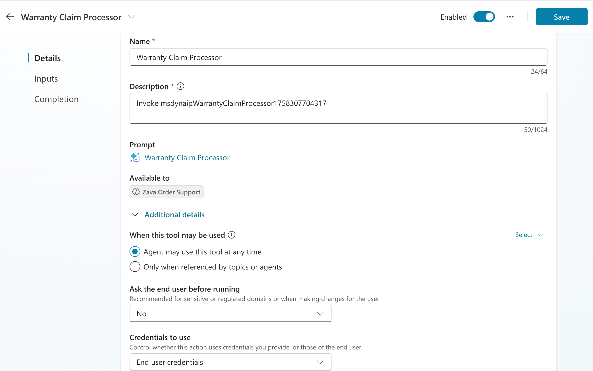

1. Next, scroll down to the Inputs section where you'll find the input you created in the prompt for warranty claim. There are two ways to fill this input: hard coding it or letting AI dynamically fill it. We want AI to dynamically fill it in this case, but we need to give it more details to know where to get that from and what it should do. To do that, click the **Customize** button next to the input.

    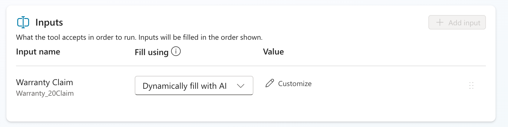

1. In the **Description** box, paste the following:

    ```text
    Fill with the details of the warranty claim pasted in the chat from the user.
    ```

1. Click the **Save** button to save all of your changes.

    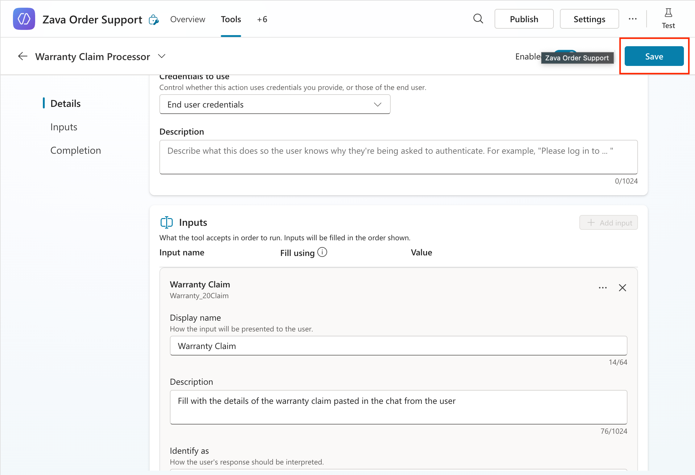

1. Select the **Overview** tab to go back to the overview screen.

    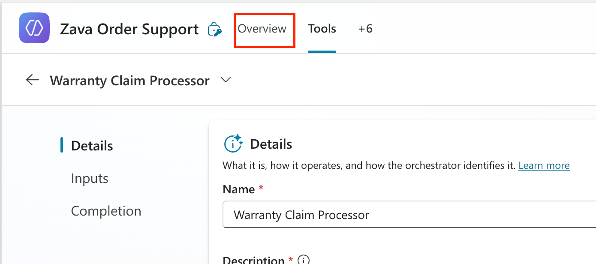

1. Now we need to modify the instructions so if someone asks for a warranty claim approval, it calls the prompt to extract information. To do this, select the **Edit** button next to the **Instructions** section.

    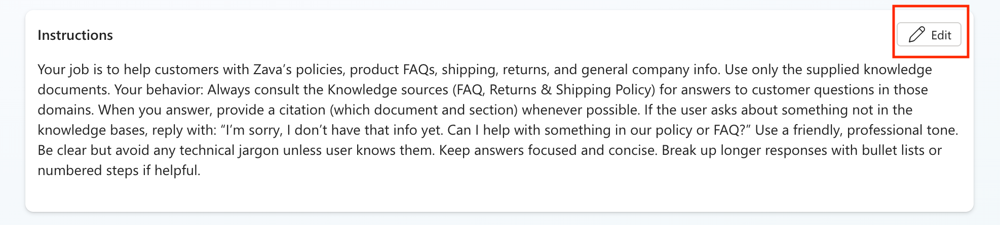

1. Paste in the following text below the instructions that are already in there.

    ```text
    If someone asks about doing a warranty claim review, call the [add prompt here] tool to extract the claim details. Look up the extracted product category in the Warranty Policy Knowledge source and extract the following information:
    
    Coverage Window
    Exceptions Allowed(Yes or No if the warranty claim has any exceptions that allow it to be approved outside the warranty period)
    Warranty Policy (full details of the warranty policy for that given product category, example: receipts required, allowed within 30 days, etc)
    
    Respond in the chat with all relevant details that were extracted.
    ```

1. Delete the **[add prompt here]** text and replace with a **forward slash (/)**. A menu will pop up where you'll see a **Tools** section. Expand that and select the **Warranty Claims Processing** prompt.

    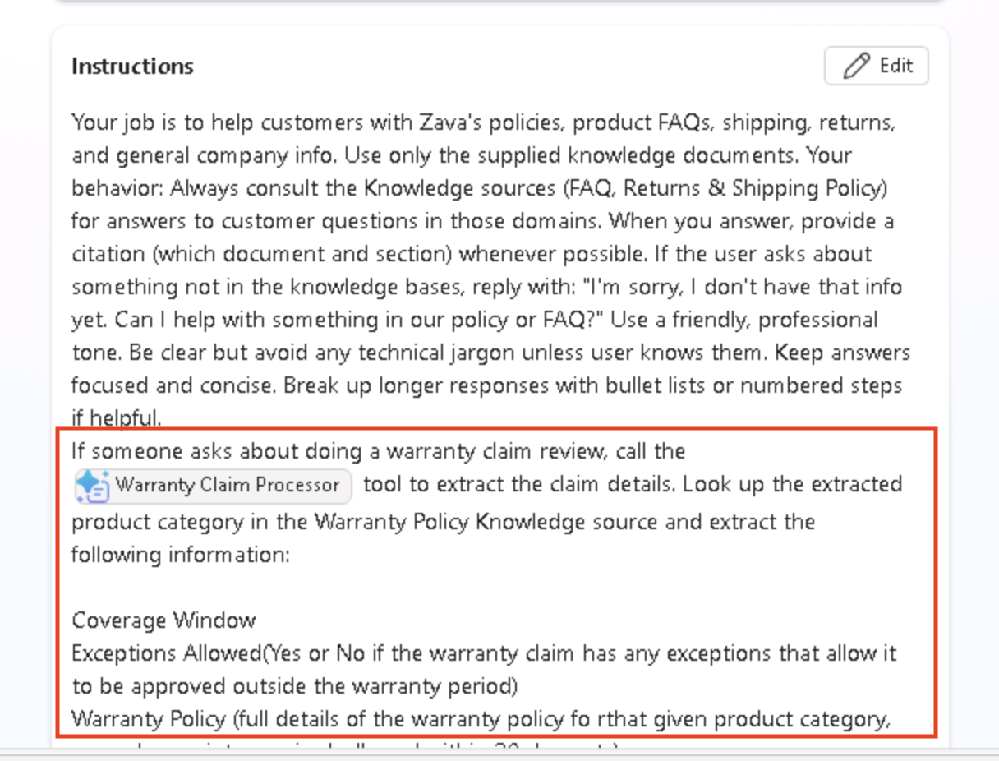

1. Click **Save** to save your new instructions.

You've just successfully added additional functionality to your agent to handle extracting warranty claim details using an AI Prompt. Now, we'll see how to improve this warranty claim review process by adding in an approval process.
