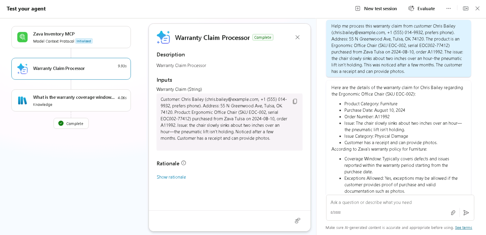

# 5 - Test Your Agent

Now that you've got the agent fully configured, it's time to test.

## Testing the Knowledge Sources

1. Ensure that the **Test** button is selected and the *Test your agent* panel shows. Select the **New test session** button.

    

1. First, let's test those knowledge sources we added back in the first section of the lab. Type in the following and press **Enter**

    ```text
    What is your return policy?
    ```

    
  
> [!NOTE]
    > Don't forget to check that your files have finished uploading and show Ready status before testing.

1. Review the output and notice the Activity Pane that displays on the left hand side showing where it pulled the answer from.

    

    > [!TIP]
    > Given the nature of generative AI, your answer might differ from the answer shown in the screenshot above. That's ok and expected. The important thing here is to observe the Activity Map and how you can tell the agent is pulling from your knowledge.

## Testing the Warranty Claim Prompt

Now we'll test the AI Prompt which helps process warranty claims.

1. Click on the **Test** button in the upper right hand corner to open the Test Panel (if it isn't already open)
1. Paste in the following text in the test window:

    ```text
    Help me process this warranty claim from customer Chris Bailey (chris.bailey@example.com, +1 (555) 014-9932, prefers phone). Address: 55 N Greenwood Ave, Tulsa, OK 74120. The product is an Ergonomic Office Chair (SKU EOC-002, serial EOC002-77412) purchased from Zava Tulsa on 2024-08-10, order A11992. The issue: the chair slowly sinks about two inches over an hour—the pneumatic lift isn’t holding. This was noticed after a few months. The customer has a receipt and can provide photos.
    ```

    Press **Enter**

1. Watch the *Test your agent* panel on the left hand side to see how the agent calls the prompt and passes in the information and does the check in the Warranty Policy knowledge source to find and return the necessary information.

    

## Testing the Agent Flow

1. Now we'll test to make sure the Agent Flow is working. Type the following in the test window and press **Enter** to send in the prompt:

    ```text
    Help me process a warranty claim for customer Alex Morgan. Address: 123 Maple Lane, Tulsa, OK 74104. Product: Zava Backpack (SKU BP-010) purchased from Zava Online on 2025-08-22, order A12876. After two commutes the main zipper pull detached; the teeth misaligned and the main compartment won’t close. Used under normal conditions.
    ```

    

1. Watch the *Test your agent* panel and notice how the agent calls the Warranty Claim Processor Prompt, pulls in knowledge and calls the flow. Since it's using generative AI, your response may vary. The important thing is to confirm you see the **Auto Approval Claims** action get called in the *Test your agent* panel and you get a response. Feel free to test a different scenario where the purchase date is not within the warranty period, say 2024-09-30, and verify that you get a different outcome.

    

> [!NOTE]
    > The agent might ask you for additional information such as the warranty coverage days. That is because sometimes, it can fail to pick up the necessary context from the chat. If this happens, reply with 10.

Congratulations! You’ve now built and tested an Order Management Agent in Copilot Studio that can pull from knowledge, consume and write to internal data through MCP and integrates with AI Prompts and Agent Flows.

Your work here is done! If there's time left feel free to play around with your agent and test other capabilities. Click **Next** and **Submit** and **Yes** if it asks about submitting for grading to close out of the lab. Don't worry - nothing is graded, if you finish the lab you get a gold star!
