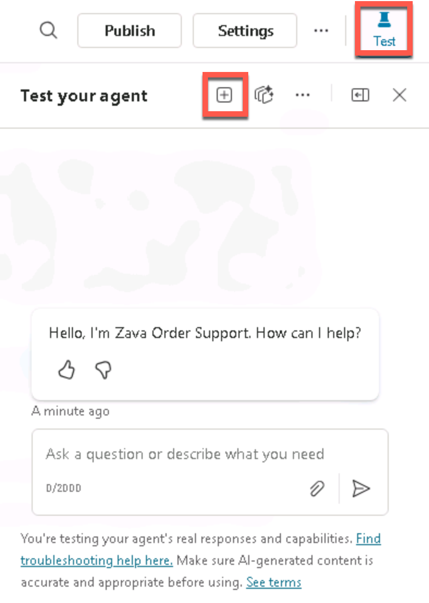
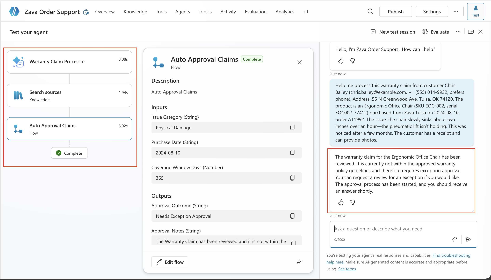

# 5 - Test Your Agent

Now that you've got the agent fully configured, it's time to test.

## Testing the Knowledge Sources

First, we are going to test those knowledge sources that we added way back at the beginning of the lab.

1. Ensure that the **Test** button is selected and the *Test your agent* panel shows. Start a new test session by clicking on the **+ icon** in the test pane. Depending on your screen resolution, you may either see only the **+ icon** or **+ New test session**.

    

1. To test those knowledge sources we added back in the first section of the lab. Type in the following and press **Enter**

    ```text
    What is your return policy?
    ```

    
  
    > [!NOTE]
        > Don't forget to check that your files have finished uploading and show Ready status before testing. If they don't show a **Ready** status then you won't get accurate results.

1. Review the output and notice the Activity Pane that displays on the left hand side showing where it pulled the answer from.

    

    > [!TIP]
    > Given the nature of generative AI, your answer might differ from the answer shown in the screenshot. That's ok and expected. The important thing here is to observe the Activity Map and how you can tell the agent is pulling from your knowledge sources.

## Testing a Warranty Claim Not Eligible for Auto-Approval

Now we'll test the mixture of the AI Prompt and Agent flow which helps process warranty claims. We'll start by testing if it can handle a warranty claim that doesn't meet auto-approval requirements.

1. Ensure that the **Test** button is selected and the *Test your agent* panel shows. Start a new test session by clicking on the **+ icon** in the test pane. Depending on your screen resolution, you may either see only the **+ icon** or **+ New test session**.

    

1. Paste in the following text in the test window:

    ```text
    Help me process this warranty claim from customer Chris Bailey (chris.bailey@example.com, +1 (555) 014-9932, prefers phone). Address: 55 N Greenwood Ave, Tulsa, OK 74120. The product is an Ergonomic Office Chair (SKU EOC-002, serial EOC002-77412) purchased from Zava Tulsa on 2024-08-10, order A11992. The issue: the chair slowly sinks about two inches over an hour—the pneumatic lift isn’t holding. This was noticed after a few months. The customer has a receipt and can provide photos.
    ```

    Press **Enter**

1. Watch the *Test your agent* panel on the left hand side. Notice how it first calls the Warranty Claim Processor prompt to extract all of the key information from your message. It then looks for the relevant knowledge and finally it calls the Auto Approval Claims Agent Flow.

    

This particular item doesn't meet the requirements in the Agent Flow for auto-approval as you can see from the response.

## Testing a Warranty Claim for Auto-Approval

Now we'll test to make sure that the warranty claim process is working to auto-approve a claim.

1. Ensure that the **Test** button is selected and the *Test your agent* panel shows. Start a new test session by clicking on the **+ icon** in the test pane. Depending on your screen resolution, you may either see only the **+ icon** or **+ New test session**.

    

1. Type the following in the test window and press **Enter** to send in the prompt:

    ```text
    Help me process a warranty claim for customer Alex Morgan. Address: 123 Maple Lane, Tulsa, OK 74104. Product: Zava Backpack (SKU BP-010) purchased from Zava Online on 2026-01-15, order A12876. After two commutes the main zipper pull detached; the teeth misaligned and the main compartment won’t close. Used under normal conditions.
    ```

    

1. Watch the **Activity Pane** and observe how the agent calls the Warranty Claim Processor Prompt, pulls in knowledge and calls the agent flow. Notice that the message is different this time, showing that this claim meets requirements for auto-approval.

    

> [!NOTE]
    > The agent might ask you for additional information such as the warranty coverage days. That happens if it fails to pick up the necessary context from the chat.

Congratulations! You’ve now built and tested an Order Management Agent in Copilot Studio that can pull from knowledge, consume and write to internal data through MCP and integrates with AI Prompts and Agent Flows.

Your work here is done! If there's time left feel free to play around with your agent and test other capabilities.

Click **Next** and **Submit** and **Yes** if it asks about submitting for grading to close out of the lab. Don't worry - nothing is graded, if you finish the lab you get a gold star!
