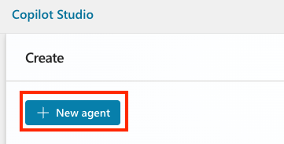
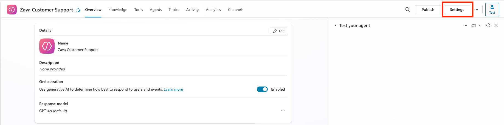
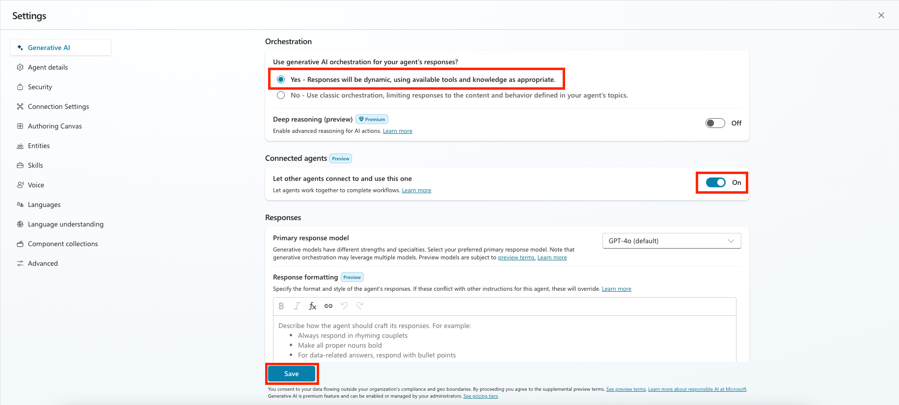
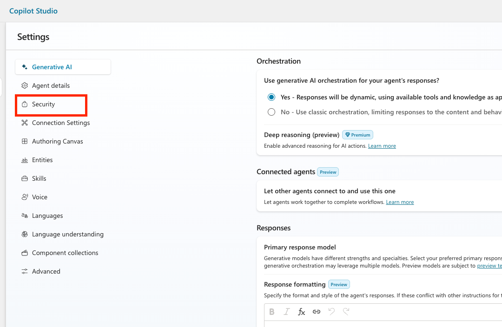

# @lab.Title

In this 75-minute hands-on workshop, you'll experience the complete journey of building an intelligent agent using Microsoft Copilot Studio. Through a practical inventory and order management scenario, you'll learn how to create a sophisticated AI assistant capable of handling real-world business operations.

## What You'll Learn

By the end of this workshop, you'll have practical experience with:

- **Agent Design & Architecture**: Understanding how to design purpose-driven agents that solve specific business problems
- **Knowledge Integration**: Adding and managing knowledge bases to make your agent contextually aware
- **Advanced Automation**: Building Agent Flows to handle deterministic, complex, multi-step business processes
- **External System Integration**: Connecting your agent to external services using Model Context Protocol (MCP) servers
- **Production Deployment**: Publishing and configuring your agent for real-world use

## Workshop Scenario

You are a solutions architect tasked with modernizing the customer service experience for Zava Retail Store, a beloved regional retailer serving suburban communities.
Currently, customers call or email to check inventory, place orders, and track shipments—creating bottlenecks for both customers and staff. Your mission is to build an intelligent Inventory Assistant that can:

- Answer product availability questions instantly
- Guide customers through the ordering process
- Provide real-time inventory updates
- Handle order modifications and cancellations
- Escalate complex issues to human agents when needed

The green text with the +++icon+++ can be clicked on and will be typed automatically into the VM, For example, please click in the password text box and then click the password: <+++@lab.VirtualMachine>(WRK530).Password+++

> [!note] To ensure text is entered accurately avoid interacting or clicking in the VM until the text has finished being typed

===

## 1 - Build your agent

To start, you're going to setup the foundation for your agent in Copilot Studio.

1. Open Microsoft Edge and navigate to

    +++<https://copilotstudio.microsoft.com+++>

1. Log in with

    <!-- markdownlint-disable-next-line MD034 -->
    **Username:** +++@lab.CloudCredential(CSBatch1).UserPrincipalName+++

    <!-- markdownlint-disable-next-line MD034 -->
    **Password:** +++@lab.CloudCredential(CSBatch1).Password+++

    <!-- markdownlint-disable-next-line MD034 -->
    **Temporary Access Password:** +++@lab.Variable(TAP)+++

1. If you see a welcome screen like is shown below, select the country/region that you’re in from the dropdown and select Get Started

    

1. If you see a welcome message as shown in the screenshot below, select Skip.

    

1. Click the Environment drop down in the top right and then select the Dev environment ENV{LAB_INSTANCE_ID}

    

1. In the left nav click **+ Create** button to start creating a new agent

    

1. Click **New agent**

    

1. While we could use natural language to setup the agent for this exercise, we will skip directly to the configuration Click the Skip to configure button

    

1. In the name field, type +++Zava Order Support+++ and then click the **Create** button

    

1. Now we need to confirm and configure some settings for our agent. To do that, select the **Settings** button in the top right hand corner

    

1. In the Generative AI tab, confirm that **Generative Orchestration** is set to **Yes** and turn **Connected Agents** to **On** then select **Save**

    

1. Select the **Security** tab in the left navigation

    

1. Select **Authentication**

    

1. Select **No Authentication** and select the **Save** button to apply the settings.

    

Congratulations! You have the foundation setup for your agent. Now you can add tools and knowledge.

===

## 2 - Extend your agent with knowledge

===

## 3 - Add an agent flow

The agent needs to handle Zava's complex business rules that include multi-stage approvals and conditional logic. This requires that we use Agent Flow approval capabilities which we'll add in this step.

1. Do this first

===

## 4 - Connect to an MCP Server

In this part, you will learn about how to run a Model Context Protocol (MCP) server and how to connect it to Microsoft Copilot Studio. Zava has created an MCP server for inventory management. The Zava Inventory Management MCP consists of a bunch of tools that you can use:

| Category | Tool | Description |
|---|---|---|
| Product management | `get_products()` | List all products |
| Product management | `get_product_by_id(product_id: int)` | Retrieve a product by its ID |
| Product management | `add_product(name: str, category: str, price: float, description: str)` | Add a new product (auto-generates SKU) |
| Product management | `remove_product(product_id: int)` | Remove a product |
| Store management | `get_stores()` | List all stores |
| Store management | `get_store_by_id(store_id: int)` | Retrieve a store by its ID |
| Store management | `add_store(name: str, city: str, country: str, address: str)` | Add a new store |
| Store management | `remove_store(store_id: int)` | Remove a store |
| Inventory management | `list_inventory_by_store(store_id: int)` | Get inventory for a store (with product details) |
| Inventory management | `list_inventory_by_product(product_id: int)` | Get inventory for a product across stores (with store details and totals) |
| Inventory management | `get_inventory_by_product_and_store(product_id: int, store_id: int)` | Get inventory for a specific product at a specific store |
| Inventory management | `update_inventory_by_product_and_store(product_id: int, store_id: int, quantity: int)` | Update the quantity for a product at a store |

The MCP server is available on `C:\src\zava-inventory-mcp\`.

### Open the MCP Server in Visual Studio Code

1. Open Visual Studio Code by selecting Visual Studio Code in the taskbar
1. Select **File > Open Folder**
1. Navigate to `C:\src\zava-inventory-mcp`
1. Select **Select Folder**

This will open the Zava Inventory Management MCP server in Visual Studio Code. After this, we will install the dependencies so that we can run the server locally.

### Install dependencies

1. Open the terminal by selecting **Terminal > New Terminal**
1. Navigate to `C:\src\zava-inventory-mcp`
1. Create a new virtual environment by running the following command:

    ```bash
    python -m venv .venv
    ```

1. Now, you need to active the virtual environment. Run the following command to do that.

    ```bash
    .venv\Scripts\activate
    ```

1. Install all dependencies by running the command below. It might take a while, so wait a little while until it's finished.

    ```bash
    pip install -r src/requirements.txt
    ```

### Setup local environment variable for authentication

The Zava MCP Server uses API key authentication to avoid that people can get to the data that gets accessed by the MCP Server. In this case, the MCP Server is using a local environment variable called `MCP_API_KEY`. Later in this lab, the MCP Server will match the value of the environment variable with the incoming request from Microsoft Copilot Studio.

Let's setup the local environment variable now.

1. Run the following command to set the value of the `MCP_API_KEY` environment variable to `AI-tour-25`.

    ```bash
    $env:MCP_API_KEY = "AI-tour-26"
    ```

### Run the MCP Server

1. Now it's time to run the MCP Server. Use the following command to start the Zava Inventory MCP Server.

    ```bash
    python src/server.py
    ```

After running the MCP Server, you're not there yet. The MCP Server is only running locally right now, so you need to make sure the MCP Server is available through a public URL. This is a requirement for Microsoft Copilot Studio. Because it's a cloud service, it's not able to reach your localhost.

### Configure a dev tunnel

In the terminal at the bottom of Visual Studio Code, there are a couple of tabs:

- Problems
- Output
- Debug Console
- Terminal
- Ports
- Spell Checker
- Azure

1. Select the tab **Ports**
1. Select **Forward a Port**
1. Enter `3000` in the port field and press **Enter**
1. Right click on the line of your forwarded port and select **Port Visibility > Public**

    Now you made your server available to the outside world.

1. Hover over the **Forwarded Address** and select the 🌐 icon

    This will prompt you if you want Code to open an external website.

1. Select **Open**

    Now your browser will be opened with the MCP Server running. The following message should be displayed:
    `The Zava Inventory 📦 MCP Server 🧠 is running`

1. In the address bar, add `/MCP` behind the address and hit **Enter**

    Now your browser will display an error, because in the browser we didn't add the API Key.
    `🔒 Authentication Failed ⛔`

We are going to fix this error in the next steps.

### Add the MCP Server in Microsoft Copilot Studio

1. Open your browser and go back to the environment where you create the agent earlier
1. Open your agent
1. In the top navigation, select **Tools**
1.

===

## 5 - Test and Publish Your Agent

Now that you have confirmed your agent is working as expected let’s publish the agent. We'll publish to the demo website which simulates what your agent would look like if it was published to a public website.

1. Click the **Publish** button in the top right-hand corner

    

1. Click the **Publish** button to publish your agent

    

    The following dialog will be displayed you can close this and your agent will finish publishing in the background

    

1. Now that it’s published, we need to make this available to use within Microsoft Teams. Select the **Channels** tab in the top menu

   

Congratulations! You’ve now built and published an agent!

===

Nothing will be graded so feel free to submit and close out of the VM. If you finished the workshop you get an A+!
