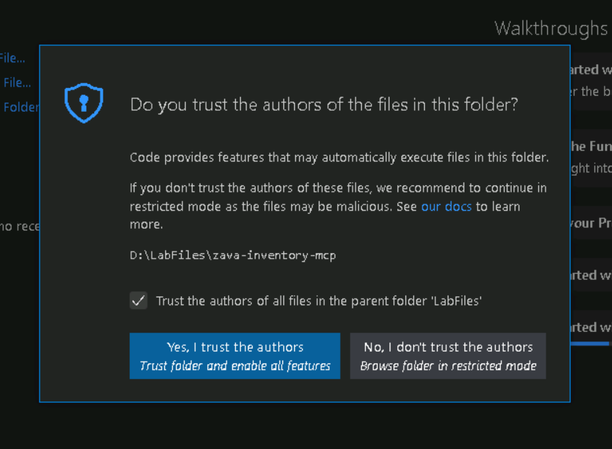
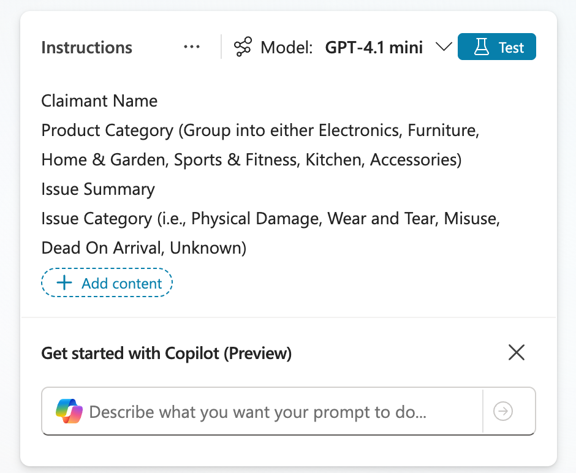
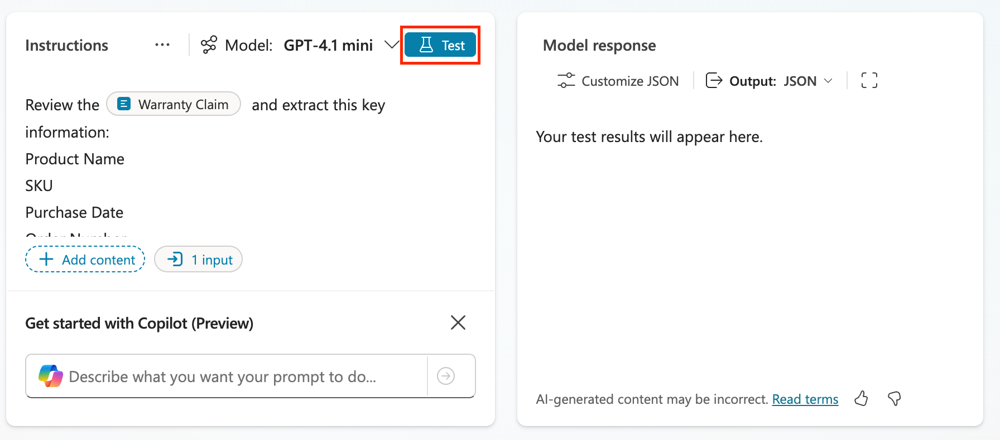
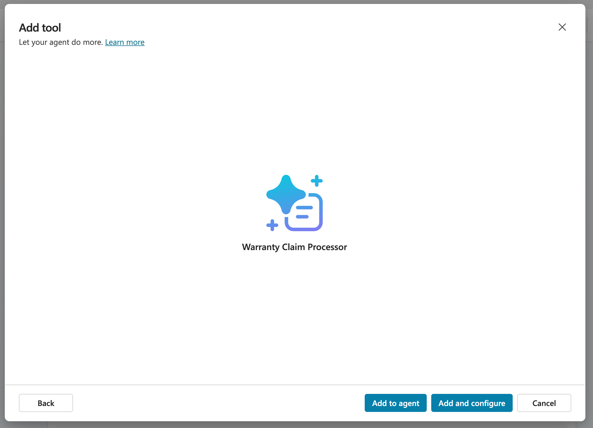
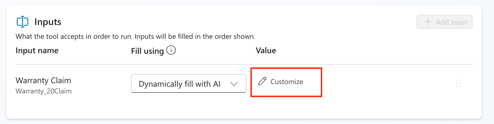

# @lab.Title

In this 75-minute hands-on workshop, you'll experience the complete journey of building an intelligent agent using Microsoft Copilot Studio. Through a practical inventory and order management scenario, you'll learn how to create a sophisticated AI assistant capable of handling real-world business operations.

## What You'll Learn

By the end of this workshop, you'll have practical experience with:

- **Agent Design & Architecture**: Understanding how to design purpose-driven agents that solve specific business problems
- **Knowledge Integration**: Adding and managing knowledge bases to make your agent contextually aware
- **Advanced Automation**: Building Agent Flows to handle deterministic, complex, multi-step business processes
- **External System Integration**: Connecting your agent to external services using Model Context Protocol (MCP) servers
- **Production Deployment**: Publishing and configuring your agent for real-world use

## Workshop Scenario

You are a solutions architect tasked with modernizing the customer service experience for Zava Retail Store, a regional retailer serving suburban communities.
Currently, customers call or email to check inventory, place orders, and track shipments which creates bottlenecks for both customers and staff. Your mission is to build an intelligent Inventory Assistant that can:

- Answer product availability questions instantly
- Guide customers through the ordering process
- Provide real-time inventory updates
- Handle order modifications and cancellations
- Escalate complex issues to human agents when needed

<!-- markdownlint-disable-next-line MD034 -->
The green text with the +++icon+++ can be clicked on and will be typed automatically into the VM, For example, please click in the password text box and then click the password: +++@lab.VirtualMachine(WRK532).Password+++

> [!note] To ensure text is entered accurately avoid interacting or clicking in the VM until the text has finished being typed

===

## 1 - Build your agent

To start, you're going to setup the foundation for your agent in Copilot Studio.

1. Open Microsoft Edge and navigate to

    +++<https://copilotstudio.microsoft.com+++>

1. Log in with

    <!-- markdownlint-disable-next-line MD034 -->
    **Username:** +++@lab.CloudCredential(CSBatch1).Username+++

    <!-- markdownlint-disable-next-line MD034 -->
    **Password:** +++@lab.CloudCredential(CSBatch1).Password+++

    <!-- markdownlint-disable-next-line MD034 -->
    **Temporary Access Password:** +++@lab.Variable(TAP)+++

1. If you see a welcome screen like is shown below, select the country/region that you’re in from the dropdown and select Get Started

    

1. If you see a welcome message as shown in the screenshot below, select Skip.

    

1. Click the Environment drop down in the top right and then select the Dev environment ENV{LAB_INSTANCE_ID}

    

1. In the left nav click **+ Create** button to start creating a new agent

    

1. Click **New agent**

    

1. While we could use natural language to setup the agent for this exercise, we will skip and configure it manually by selecting the **Configure** tab.

    

1. In the name field, type +++Zava Order Support+++ and then click the **Create** button

    

1. Now that our agent is created, we need to equip it with knowledge so it can answer questions about our company background, shipping policies, etc. This information is stored in two PDF documents which you need to download, the [Zava FAQ Doc](./assets/zava_faq.pdf) and [Zava Policies Doc](./assets/zava_returns_shipping_policy.pdf).

1. In your agent overview screen, scroll down to the knowledge section and select the **Add Knowledge** tab.

    

1. Drag and drop the [Zava FAQ Doc](./assets/zava_faq.pdf) and [Zava Policies Doc](./assets/zava_returns_shipping_policy.pdf) files you downloaded in the step above into the canvas

    

1. Verify the files are added and select **Add to Agent**

    

1. You'll know your files are ready to use when you see the **Ready** checkbox next to each file.

    

1. Now we need to tell the agent what it's supposed to do. To do this, scroll up to the Instructions section and select the **Edit** button and paste in the following instructions:

    ```text
    Your job is to help customers with Zava’s policies, product FAQs, shipping, returns, and general company info. Use only the supplied knowledge documents.
        Your behavior:
        Always consult the Knowledge sources (FAQ, Returns & Shipping Policy) for answers to customer questions in those domains.
        When you answer, provide a citation (which document and section) whenever possible.
        If the user asks about something not in the knowledge bases, reply with: “I’m sorry, I don’t have that info yet. Can I help with something in our policy or FAQ?”
        Use a friendly, professional tone. Be clear but avoid any technical jargon unless user knows them.
        Keep answers focused and concise. Break up longer responses with bullet lists or numbered steps if helpful.
    ```

    Click **Save**

    

1. Now we need to test the agent. Ensure that the test panel is open on the right hand side of the page, type in the following and press **Enter**

    > What is your return policy?

    

1. Review the output and notice the Activity Pane that displays on the left hand side showing where it pulled the answer from.

    

Congratulations! You have setup an agent that can answer questions about static data from files! Next ,we'll integrate it with an MCP server.

===

## 2 - Connect to an MCP Server

In this part, you will learn about how to run a Model Context Protocol (MCP) server and how to connect it to Microsoft Copilot Studio. Zava has created an MCP server for inventory management. The Zava Inventory Management MCP consists of a bunch of tools that you can use:

| Category | Description |
|---|---|
| Product management | List all products |
| Product management | Retrieve a product by its ID |
| Product management | Add a new product (auto-generates SKU) |
| Product management | Remove a product |
| Store management | List all stores |
| Store management | Retrieve a store by its ID |
| Store management | Add a new store |
| Store management | Remove a store |
| Inventory management | Get inventory for a store (with product details) |
| Inventory management | Get inventory for a product across stores (with store details and totals) |
| Inventory management | Get inventory for a specific product at a specific store |
| Inventory management | Update the quantity for a product at a store |

The MCP server is available on **D:\LabFiles\zava-inventory-mcp**.

### Open the MCP Server in Visual Studio Code

1. Open Visual Studio Code by selecting Visual Studio Code in the taskbar
1. Select **File > Open Folder**
1. Navigate to **D:\LabFiles\zava-inventory-mcp**
1. Select **Select Folder**
1. You will see a pop up where you will be asked to trust the authors of the files in this folder. Make sure to select **Yes, I trust the authors**

    

This will open the Zava Inventory Management MCP server in Visual Studio Code. After this, we will install the dependencies so that we can run the server locally.

### Install dependencies

1. Open the terminal by selecting **Terminal > New Terminal**
1. Make sure you are in the following folder: **D:\LabFiles\zava-inventory-mcp**
1. Create a new virtual environment by running the following command:

    ```bash
    python -m venv .venv
    ```

1. Now, you need to active the virtual environment. Run the following command to do that.

    ```bash
    .venv\Scripts\activate
    ```

1. Install all dependencies by running the command below. It might take a while, so wait a little while until it's finished.

    ```bash
    pip install -r src/requirements.txt
    ```

### Run the MCP Server

1. Now it's time to run the MCP Server. Use the following command to start the Zava Inventory MCP Server.

    ```bash
    python src/server.py
    ```

After running the MCP Server, you're not there yet. The MCP Server is only running locally right now, so you need to make sure the MCP Server is available through a public URL. This is a requirement for Microsoft Copilot Studio. Because it's a cloud service, it's not able to reach your localhost.

### Configure a dev tunnel

To make sure we can reach the MCP Server from Microsoft Copilot Studio, we'll add a dev tunnel. During these steps, you will be prompted to log in. Use the Entra ID account from this workshop when you are prompted to log in.

In the terminal at the bottom of Visual Studio Code, we are going to configure a dev tunnel.

1. Select the **+** in the top right corner of the terminal

    

    This will open a new terminal, so that we don't stop our running server.

1. Run the following command to login to the dev tunnel service

    ```bash
    devtunnel login
    ```

1. In the pop-up that will appear, select **Work or School account** and select **Continue**
1. Log in with

    <!-- markdownlint-disable-next-line MD034 -->
    **Username:** +++@lab.CloudCredential(CSBatch1).Username+++

    <!-- markdownlint-disable-next-line MD034 -->
    **Password:** +++@lab.CloudCredential(CSBatch1).Password+++

    <!-- markdownlint-disable-next-line MD034 -->
    **Temporary Access Password:** +++@lab.Variable(TAP)+++

1. Run the following command to create the devtunnel:

    ```bash
    devtunnel create -a
    ```

    Copy the output of the new dev tunnel. This is the **tunnel ID** of the dev tunnel which we need in the following commands.

<!-- markdownlint-disable-next-line MD033 -->
1. Replace **<tunnel-id>** with the **tunnel ID** you just copied and run the following command to open port 3000 for the dev tunnel:

    ```bash
    devtunnel port create <tunnel-id> -p 3000
    ```

<!-- markdownlint-disable-next-line MD033 -->
1. Replace **<tunnel-id>** with the **tunnel ID** you just copied and run the following command to host the dev tunnel:

    ```bash
    devtunnel host <tunnel-id>
    ```

1.

    Now your browser will be opened with the MCP Server running. The following message should be displayed:  
    The Zava Inventory 📦 MCP Server 🧠 is running

1. In the address bar, add `/mcp` behind the address and hit **Enter**

    Now your browser will display an error, because in the browser we didn't add the API Key.  
    🔒 Authentication Failed ⛔

We are going to fix this error in the next steps.

### Add the MCP Server in Microsoft Copilot Studio

1. Open your browser and go back to the environment where you create the agent earlier
1. Open your agent
1. In the top navigation, select **Tools**
1. Select **+ Add a tool**
1. Select **+ New tool**
1. Select **Model Context Protocol**
1. Enter the **Name**:

      ```text
      Zava Inventory MCP
      ```

1. Enter the **Description**:

      ```text
      Zava Inventory MCP
      ```

1. Enter the **Server URL**. This should be the URL you opened from the ports tab in Visual Studio Code without the `https://` in front of it and with the `/mcp` behind it. For example: `something-3000.something.devtunnels.ms/mcp`.
1. For *Authentication*, select **API key**
1. Leave the *type* on *Header* and for *Header name* add the following value:

      ```text
      authorization
      ```

      

1. Check if all the values are correct and if so, select **Create** to add the MCP Server

    This will take a while, since in the background it is creating a custom connector for the MCP Server.

1. When it's done, select **Not connected** and **Create new connection**
1. Enter the **API Key**:

      ```text
      AITour2026!
      ```

1. Select **Add to agent**

    

    Now it's time to test the agent with the MCP Server!

1. Select the **Map** icon in the top right corner of the *Test your agent* panel to activate the *Activity map*. This will help you understand what is happening when you are sending and receiving messages in the *Test your agent* panel.

    

1. Now, enter the following message and send it in the *Test your agent* panel:

      ```text
      List the Zava Stores
      ```

    This should show you a whole bunch of Zava Stores as an answer in the *Test your agent* panel:

    

    And on the left in the *Activity map*, you can see that the Zava Inventory MCP has been initialized and the *get_stores* tool has been triggered by our message. When you click on the *get_stores* tool, you're even able to see the output that the agent got from the MCP server. This means our agent made that text into the formatted output we saw in the *Test your agent* panel.

    

    Let's experiment a bit more with the other tools as well.

1. Send the following message to your agent via the *Test your agent* panel:

      ```text
      List the available products in the Zava Amsterdam store
      ```

    You will see the available products in the Zava Amsterdam store in the *Test your agent* panel:

    

    Now you can see in the *Activity map* more tools have been triggered. The *get_stores* tool has been triggered again, because it needs it for the *list_inventory_by_store* tool. This really shows the power of MCP: when used correctly, it can do a lot of calls for you, without having to build a flow for it or to give it more instructions.

    

    But now - we only did get actions, wouldn't it be good to also add something?

1. Send the following message to your agent via the *Test your agent* panel:

    ```text
    Please add the following Zava Store:
    Zava Chicago
    1597 Virginia Street, Chicago, Illinois, IL 60618
    ```

    

    As you can see, we didn't add United States to the message, but it automatically added that based on the details in the message.

    

This section was to help you understand how to use MCP in a Copilot Studio agent. If you have time left at the end of this workshop, feel free to play around with the other tools in the MCP Server.

===

## 3 - Add a Prompt for Warranty Claim Processing

Now that we’ve got an agent that can answer questions from knowledge and integrate with our MCP server for live ops (stores/inventory CRUD), we’ll take it a step further: integrating an AI prompt to process warranty claims. Why? Because claims aren’t a single lookup—they’re a mini workflow. In this section, we’ll add a small Warranty Policy knowledge source (category-based rules), then use a single AI prompt to turn messy, pasted claim text into clean fields (customer/contact, product/SKU, purchase date → days since purchase, product category, issue category).

1. In your agent overview screen, scroll down to the knowledge section and select the **Add Knowledge** tab.

    

1. Download the [Zava Warranty Policy Doc](./assets/Zava_Warranty_Policy.pdf) and drag and drop it onto the canvas.

    

1. Verify the files are added and select **Add to Agent**

    

1. You'll know your files are ready to use when you see the **Ready** checkbox next to each file.

    

Now that we have the Warranty Claim knowledge source added, we want to build our AI Prompt to extract information from the claim.

1. Scroll down to the Tools section and select **Add tool**

    

1. Select **New Tool**

    

1. Select **Prompt**

    

1. Click in the top bar next to the icon and rename the prompt to  ```Warranty Claim Processor```

    

1. Paste the following instructions into the instructions panel of the prompt:

```text
Review the [add input here] and extract this key information:
Product Name
SKU
Purchase Date
Order Number
Claimant Name
Product Category (Group into either Electronics, Furniture, Home & Garden, Sports & Fitness, Kitchen, Accessories)
Issue Summary
Issue Category (i.e., Physical Damage, Wear and Tear, Misuse, Dead On Arrival, Unknown)
```



1. Delete the **[add input here]** text and type a **forward slash (/)** and select **text** to add a new variable

    

1. Name this variable **Warranty Claim** and put in the following text in the **Sample data** input:

    ```text
    Help me process this warranty claim from this customer: Alex Morgan (alex.morgan@example.com, +1 (555) 012-7784, prefers email). Address: 123 Maple Lane, Tulsa, OK 74104. Product is a Zava Backpack (SKU BP-010) purchased from Zava Online on 2025-08-22, order A12876. After two commutes the main zipper pull detached; the teeth misalign and the main compartment won’t close—used under normal conditions. Please evaluate against our warranty policy and advise approval/denial and next steps (including RMA if applicable).
    ```

    Select the **close button**

    

1. Select the **Output** dropdown and change it to **JSON** so we can get a structured response.

    

1. Before saving, we have to test to make sure the prompt works correctly, that is why we put sample data in our input in the previous step. To do that, click the **Test** button.

    

1. Review the output of the test and notice how it extracted all the info in a structured format. Click the **Save** button to save this new prompt.

    

1. Now click the **Add and configure** button to add this to the agent and take you directly to the configuration page for the prompt.

    

1. Now we'll see the configuration screen where we can control specific settings for the prompt for use in our agent. The first thing we need to do is expand out the **Additional details** section and select the **Agent may use thsi tool at any time** radio button.

    

1. Next, scroll down to the Inputs section where you'll find the input you created in the prompt for warranty claim. There are two ways to fill this input: hard coding it or letting AI dynamically fill it. We want AI to dynamically fill it in this case, but we need to give it more details to know where to get that from and what it should do. To do that, click the **Customize** button next to the input.

    

1. In the **Description** box, paste the following:
Fill with the details of the warranty claim pasted in the chat from the user.

    

1. Click the **Save** button to save all of your changes.

    

1. Select the **Overview** tab to go back to the overview screen.

    

1. Now we need to modify the instructions so if someone asks for a warranty claim approval, it calls the prompt to extract information. To do this, select the **Edit** button next to the **Instructions** section.

    

1. Paste in the following text below the instructions that are already in there.

    ```text
    If someone asks about doing a warranty claim review, call the [add prompt here] tool to extract the claim details. Look up the extracted product category in the Warranty Policy Knowledge source and extract the following information:
    
    Coverage Window
    Exceptions Allowed(Yes or No if the warranty claim has any exceptions that allow it to be approved outside the warranty period)
    Warranty Policy (full details of the warranty policy fo rthat given product category, example: receipts required, allowed within 30 days, etc)
    
    Respond in the chat with all relevant details that were extracted.
    ```


1. Delete the [add prompt here] text and replace with a forward slash (/). A menu will pop up where you'll see a **Tools** section. Expand that and select the **Warranty Claims Processing** prompt.

    

1. Click **Save** to save your new instructions.
1. Now it's time to test the end to end process.Click on the **Test** button in the upper right hand corner to open the Test Panel (if it isn't already open)
1. Paste in the following text in the test window:

    ```text
    Help me process this warranty claim from customer Chris Bailey (chris.bailey@example.com, +1 (555) 014-9932, prefers phone). Address: 55 N Greenwood Ave, Tulsa, OK 74120. The product is an Ergonomic Office Chair (SKU EOC-002, serial EOC002-77412) purchased from Zava Tulsa on 2024-08-10, order A11992. The issue: the chair slowly sinks about two inches over an hour—the pneumatic lift isn’t holding. This was noticed after a few months. The customer has a receipt and can provide photos.
    ```

    Press **Enter**


1. Watch the Activity Panel on the left hand side to see how the agent calls the prompt and passes in the information and does the check in the Warranty Policy knowledge source to find and return the necessary information.

    

You've just sucessfully added additional functionality to your agent to handle extracting warranty claim details using an AI Prompt. Now, we'll see how to improve this warranty claim review process by adding in an approval process.

## 4 - Add an Agent Flow for Approving Warranty Claims

Now that we have an AI prompt can classify warranty claims and extract key info, we’re going to wrap this process in a formal, approval path based off of certain conditions (is it in the warranty period, are there any exceptions, etc). This is exactly what Agent Flows are for: augmenting your agents with a configurable and predictable decision path. In this section, you’ll build an agent flow that reads the extracted fields, evaluates the policy conditions, triggers a one-click Approval step when needed, and returns a clear outcome.

1. To create a new agent flow, scroll down to the Tools section and select **New Tool**
    

1. Select **New Tool** in the dialog

    

1. Select **Agent Flow**. This will route you to a new agent flow that you'll need to configure.

    

1. You'll see two items on the screen, the trigger which kicks off the flow and the response which returns data back to the agent. The first thing we need to do is configure any inputs that we want to pass into our flow from the agent to use in the flow. To add these inputs, select the **When an agent calls the flow** trigger.
1. Select **Add an input**
1. Select the **Text** option
1. In the Text input type **Product**
1. Select **Add an input** again
1. Select the **Text** option
1. In the Text input type **Product Category**
1. Select **Add an input** again
1. Select the **Text** option
1. In the Text input type **Issue Category**
1. Select **Add an input** again
1. Select the **Text** option
1. In the Text input type **Issue Description**
1. Select **Add an input** again
1. Select the **Text** option
1. In the Text input type **Purchase Date**
1. Select **Add an input** again
1. Select the **Text** option
1. In the Text input type **Coverage Window**
1. Select **Add an input** again
1. Select the **Text** option
1. In the Text input type **Warranty Policy**
1. Select the **plus button** between the when an agent calls a flow and respond to agent.

    

1. Scroll down to the Human in the Loop section and select the **Start and Wait for Approval**.

    

1. In the Approval Type dropdown select **Approve/Reject - First to Respond**

    

1. For the Title input put ```Approve New Store Onboarding```

    

1. For the Assigned To enter your username

    

1. Now we need to be sure we can pass relevant information about the new store to the flow to include in our approval request. To do that we need to scroll up and select the **When an agent calls a flow** trigger and select **Add Input**

    

1. Select **Text** from the list of input options

    

1. ddd

===

## 4 - Test and Publish Your Agent

Now that you have confirmed your agent is working as expected let’s publish the agent. We'll publish to the demo website which simulates what your agent would look like if it was published to a public website.

1. Now we need to confirm and configure some settings for our agent. To do that, select the **Settings** button in the top right hand corner

    

1. In the Generative AI tab, confirm that **Generative Orchestration** is set to **Yes** and turn **Connected Agents** to **On** then select **Save**

    

1. Select the **Security** tab in the left navigation

    

1. Select **Authentication**

    

1. Select **No Authentication** and select the **Save** button to apply the settings.

    

1. Click the **Publish** button in the top right-hand corner

    

1. Click the **Publish** button to publish your agent

    

    The following dialog will be displayed you can close this and your agent will finish publishing in the background

    

1. Now that it’s published, we need to make this available to use within Microsoft Teams. Select the **Channels** tab in the top menu

   

Congratulations! You’ve now built and published an agent!

===

Nothing will be graded so feel free to submit and close out of the VM. If you finished the workshop you get an A+!
