## 1 - Build your agent

To start, you're going to setup the foundation for your agent in Copilot Studio.

1. Open Microsoft Edge and navigate to

    <!-- markdownlint-disable-next-line MD034 -->
    +++https://copilotstudio.microsoft.com+++

1. Log in with

    <!-- markdownlint-disable-next-line MD034 -->
    **Username:** +++@lab.CloudCredential(CSBatch1).Username+++

    <!-- markdownlint-disable-next-line MD034 -->
    **Password:** +++@lab.CloudCredential(CSBatch1).Password+++

    <!-- markdownlint-disable-next-line MD034 -->
    **Temporary Access Password:** +++@lab.Variable(TAP)+++

1. If you see a welcome screen like is shown below, select the country/region that you’re in from the dropdown and select Get Started

    

1. If you see a welcome message as shown in the screenshot below, select Skip.

    

1. If you see the below screen that says **Start building your agent**, click the **three dots (...)** in the upper right hand corner and select **Cancel Agent Creation**

    

1. Select **Yes, continue**

    

1. Click the Environment drop down in the top right and then select the Dev environment @ENV{LAB_INSTANCE_ID}

    

1. In the left nav click **+ Create** button to start creating a new agent

    

1. Click **New agent**

    

1. While we could use natural language to setup the agent for this exercise, we will skip and configure it manually by selecting the **Configure** tab.

    

1. In the name field, type +++Zava Order Support+++ and then click the **Create** button

    

    > [!NOTE]
    > It could take a minute or two for the agent to fully configure. You'll see a message that says **Your agent is provisioned!** when it's ready.

1. Now that our agent is created, we need to equip it with knowledge so it can answer questions about our company background, shipping policies, etc. In your agent overview screen, scroll down to the knowledge section and select the **Add Knowledge** tab.

    

1. Click the **select to browse** button and navigate to **D:\LabFiles\KnowledgeDocuments**. Select the **zava_faq** and **zava_returns_shipping_policy documents**.

    

1. Verify the files are added and select **Add to Agent**

    

1. You'll know your files are ready to use when you see the **Ready** checkbox next to each file.

    

> [!NOTE]
> The process of uploading the files can take around 5 minutes to complete.

1. Now we need to tell the agent what it's supposed to do. To do this, scroll up to the Instructions section and select the **Edit** button and paste in the following instructions:

    ```text
    Your job is to help customers with Zava’s policies, product FAQs, shipping, returns, and general company info. Use only the supplied knowledge documents. Your behavior: Always consult the Knowledge sources (FAQ, Returns & Shipping Policy) for answers to customer questions in those domains. When you answer, provide a citation (which document and section) whenever possible. If the user asks about something not in the knowledge bases, reply with: “I’m sorry, I don’t have that info yet. Can I help with something in our policy or FAQ?” Use a friendly, professional tone. Be clear but avoid any technical jargon unless user knows them. Keep answers focused and concise. Break up longer responses with bullet lists or numbered steps if helpful.
    ```

    Click **Save**

    

1. Now we need to test the agent. Ensure that the test panel is open on the right hand side of the page, type in the following and press **Enter**

    ```text
    What is your return policy?
    ```

    

1. Review the output and notice the Activity Pane that displays on the left hand side showing where it pulled the answer from.

    

    > [!TIP]
    > Given the nature of generative AI, your answer might differ from the answer shown in the screenshot above. That's ok and expected. The important thing here is to observe the Activity Map and how you can tell the agent is pulling from your knowledge.

Congratulations! You have setup an agent that can answer questions about static data from files! Next ,we'll integrate it with an MCP server.

===

## 2 - Connect to an MCP Server

In this part, you will learn about how to run a Model Context Protocol (MCP) server and how to connect it to Microsoft Copilot Studio. Zava has created an MCP server for inventory management that provides tools for managing products (like get_products and add_product), stores (such as get_stores and add_store), and inventory operations (including list_inventory_by_store). The MCP server is available on **D:\LabFiles\ZavaInventoryMCP**.

### Open the MCP Server in Visual Studio Code

1. Open Visual Studio Code by selecting Visual Studio Code in the taskbar
1. Select **File > Open Folder**
1. Navigate to **D:\LabFiles\ZavaInventoryMCP**
1. Select **Select Folder**
1. You might see a pop up where you will be asked to trust the authors of the files in this folder. Make sure to select **Yes, I trust the authors**

    

This will open the Zava Inventory Management MCP server in Visual Studio Code. Let's explore the MCP Server to see what files are in there.

### Explore the Zava Inventory Management MCP Server

The MCP server folder contains several key files that make up the MCP Server:

#### Source files

Expand the **src** folder in the **Explorer** section on the left hand side and browse the source files.

- **src/server.py**: The main MCP server implementation with all tools for products, stores, and inventory
- **src/helpers.py**: Utility functions for data loading and JSON file operations
- **src/middleware.py**: Authentication middleware for API key validation
- **src/requirements.txt**: Python dependencies needed to run the server

#### Data files

Expand the **Data** folder to see what's in this folder.

- **data/products.json**: Sample product data with products
- **data/stores.json**: Sample store data with store locations
- **data/inventory.json**: Sample inventory records with stock entries

Make sure to look around in these files to see what's going on in the server. Now, let's install the dependencies so that we can run the server locally.

### Install dependencies

1. Open the terminal by selecting **Terminal > New Terminal**
1. Make sure you are in the following folder: **D:\LabFiles\ZavaInventoryMCP**
1. Create a new virtual environment by running the following command (press **Enter** after pasting in the terminal to run it):

    ```bash
    python -m venv .venv
    ```

1. Now, you need to activate the virtual environment. Run the following command to do that.

    ```bash
    .venv\Scripts\activate
    ```

1. Install all dependencies by running the command below. It might take a while, so wait a little while until it's finished.

    ```bash
    pip install -r src/requirements.txt
    ```

### Run the MCP Server

1. Now it's time to run the MCP Server. Use the following command to start the Zava Inventory MCP Server.

    ```bash
    python src/server.py
    ```

After running the MCP Server, you're not there yet. The MCP Server is only running locally right now, so you need to make sure the MCP Server is available through a public URL. This is a requirement for Microsoft Copilot Studio. Because it's a cloud service, it's not able to reach your localhost.

### Configure a dev tunnel

To make sure we can reach the MCP Server from Microsoft Copilot Studio, we'll add a dev tunnel. During these steps, you will be prompted to log in. Use the Entra ID account from this workshop when you are prompted to log in.

In the terminal at the bottom of Visual Studio Code, we are going to configure a dev tunnel.

1. Select the **+** in the top right corner of the terminal

    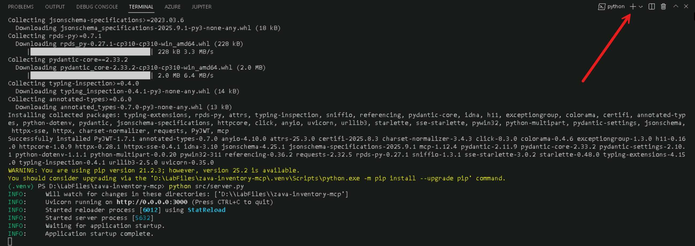

    This will open a new terminal, so that we don't stop our running server.

1. Run the following command to login to the dev tunnel service

    ```bash
    devtunnel login
    ```

1. In the pop-up that will appear, select **Work or School account** and select **Continue**
1. Log in with:

    <!-- markdownlint-disable-next-line MD034 -->
    **Username:** +++@lab.CloudCredential(CSBatch1).Username+++

    <!-- markdownlint-disable-next-line MD034 -->
    **Password:** +++@lab.CloudCredential(CSBatch1).Password+++

    <!-- markdownlint-disable-next-line MD034 -->
    **Temporary Access Password:** +++@lab.Variable(TAP)+++

1. In the next screen where it asks if you want to automatically sign into all desktop apps on this device, select **No, this app only**

    

1. Run the following command to create the devtunnel:

    ```bash
    devtunnel create -a
    ```

<!-- markdownlint-disable-next-line MD033 -->
1. Run the following command to open port 3000 for the dev tunnel:

    ```bash
    devtunnel port create -p 3000
    ```

<!-- markdownlint-disable-next-line MD033 -->
1. Run the following command to host the dev tunnel:

    ```bash
    devtunnel host
    ```

    This will give you the following message:  

    <!-- markdownlint-disable-next-line MD033 -->
    Connect via browser: <https://x.devtunnels.ms:3000>, <https://x-3000.x.devtunnels.ms>
    <!-- markdownlint-disable-next-line MD033 -->
    Inspect network activity: <https://x-3000-inspect.x.devtunnels.ms>
    Ready to accept connections for tunnel: x.x

1. Open the first URL after connect via browser by using **ctrl + click**

    Now your browser will be opened and you will see a warning like this:

    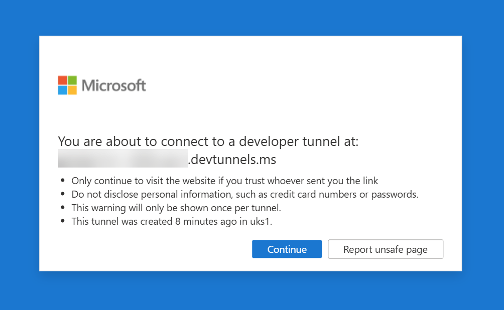

1. Select **Continue**

    Now, the following message should be displayed:  

    The Zava Inventory 📦 MCP Server 🧠 is running

1. In the address bar, add `/mcp` behind the address and hit **Enter**

    Now your browser will display an error, because in the browser we didn't add the API Key.  
    🔒 Authentication Failed ⛔

We are going to fix this error in the next steps.

### Add the MCP Server in Microsoft Copilot Studio

1. Open your browser and go back to the environment where you create the agent earlier
1. Open your agent
1. In the top navigation, select **Tools**
1. Select **+ Add a tool**
1. Select **+ New tool**
1. Select **Model Context Protocol**
1. Enter the **Name**:

      ```text
      Zava Inventory MCP
      ```

1. Enter the **Description**:

      ```text
      Zava Inventory MCP
      ```

1. Enter the **Server URL**. This should be the URL you opened earlier during the devtunnel steps without the *https://* in front of it and with the */mcp* behind it. For example: *x.devtunnels.ms/mcp*.
1. For *Authentication*, select **API key**
1. Leave the *type* on *Header* and for *Header name* add the following value:

      ```text
    authorization
      ```

      

1. Check if all the values are correct and if so, select **Create** to add the MCP Server

    This will take a while, since in the background it is creating a custom connector for the MCP Server.

1. When it's done, select **Not connected** and **Create new connection**

      

1. Enter the **API Key**:

      ```text
    AITour2026!
      ```

1. Select **Create**

    

1. Select **Add to agent**

    

    Now it's time to test the agent with the MCP Server!

1. Select the **Map** icon in the top right corner of the *Test your agent* panel to activate the *Activity map*. This will help you understand what is happening when you are sending and receiving messages in the *Test your agent* panel.

    

1. Now, enter the following message and send it in the *Test your agent* panel:

      ```text
      List the Zava Stores
      ```

    This should show you a whole bunch of Zava Stores as an answer in the *Test your agent* panel:

    

    And on the left in the *Activity map*, you can see that the Zava Inventory MCP has been initialized and the *get_stores* tool has been triggered by our message. When you click on the *get_stores* tool, you're even able to see the output that the agent got from the MCP server. This means our agent made that text into the formatted output we saw in the *Test your agent* panel.

    

    Let's experiment a bit more with the other tools as well.

1. Send the following message to your agent via the *Test your agent* panel:

      ```text
      List the available products in the Zava Amsterdam store
      ```

    You will see the available products in the Zava Amsterdam store in the *Test your agent* panel:

    

    Now you can see in the *Activity map* more tools have been triggered. The *get_stores* tool has been triggered again, because it needs it for the *list_inventory_by_store* tool. This really shows the power of MCP: when used correctly, it can do a lot of calls for you, without having to build a flow for it or to give it more instructions.

    

    But now - we only did get actions, wouldn't it be good to also add something?

1. Send the following message to your agent via the *Test your agent* panel:

    ```text
    Please add the following Zava Store:
    Zava Chicago
    1597 Virginia Street, Chicago, Illinois, IL 60618
    ```

    

    As you can see, we didn't add United States to the message, but it automatically added that based on the details in the message.

    

This section was to help you understand how to use MCP in a Copilot Studio agent. If you have time left at the end of this workshop, feel free to play around with the other tools in the MCP Server.

===

## 3 - Add a Prompt for Warranty Claim Processing

Now that we’ve got an agent that can answer questions from knowledge and integrate with our MCP server for real time operations, we’ll take it a step further: integrating an AI prompt to process warranty claims. In this section, we’ll add a Warranty Policy knowledge source (category-based rules), then use a single AI prompt to turn messy, pasted claim text into clean fields and even intelligently classify the claim.

1. In your agent overview screen, scroll down to the knowledge section and select the **Add Knowledge** tab.

    

1. Download the [Zava Warranty Policy Doc](./assets/Zava_Warranty_Policy.pdf) and drag and drop it onto the canvas.

    

1. Verify the files are added and select **Add to Agent**

    

1. You'll know your files are ready to use when you see the **Ready** checkbox next to each file.

    

Now that we have the Warranty Claim knowledge source added, we want to build our AI Prompt to extract information from the claim.

1. Scroll down to the Tools section and select **Add tool**

    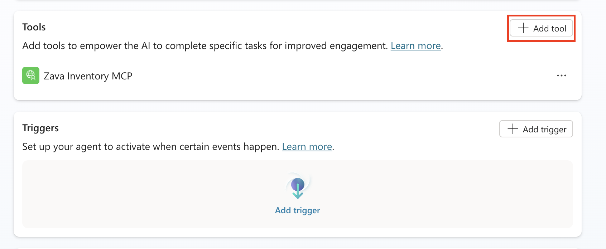

1. Select **New Tool**

    

1. Select **Prompt**

    

1. Click in the top bar next to the icon and rename the prompt to  ```Warranty Claim Processor```

    

1. Paste the following instructions into the instructions panel of the prompt:

```text
Review the [add input here] and extract this key information:
Product Name
SKU
Purchase Date
Order Number
Claimant Name
Product Category (Group into either Electronics, Furniture, Home & Garden, Sports & Fitness, Kitchen, Accessories)
Issue Summary
Issue Category (i.e., Physical Damage, Wear and Tear, Misuse, Dead On Arrival, Unknown)
```


1. Delete the **[add input here]** text and type a **forward slash (/)** and select **text** to add a new variable

    

1. Name this variable **Warranty Claim** and put in the following text in the **Sample data** input:

    ```text
    Help me process this warranty claim from this customer: Alex Morgan (alex.morgan@example.com, +1 (555) 012-7784, prefers email). Address: 123 Maple Lane, Tulsa, OK 74104. Product is a Zava Backpack (SKU BP-010) purchased from Zava Online on 2025-08-22, order A12876. After two commutes the main zipper pull detached; the teeth misalign and the main compartment won’t close—used under normal conditions. Please evaluate against our warranty policy and advise approval/denial and next steps (including RMA if applicable).
    ```

    Select the **close button**

    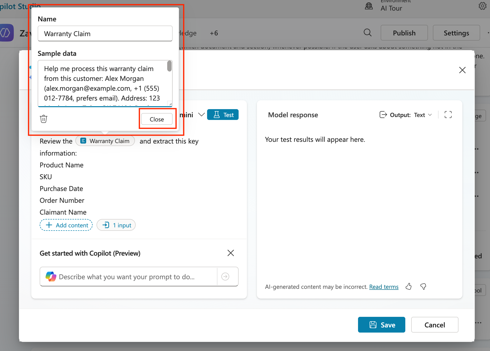

1. Select the **Output** dropdown and change it to **JSON** so we can get a structured response.

    

1. Before saving, we have to test to make sure the prompt works correctly, that is why we put sample data in our input in the previous step. To do that, click the **Test** button.

    

1. Review the output of the test and notice how it extracted all the info in a structured format. Click the **Save** button to save this new prompt.

    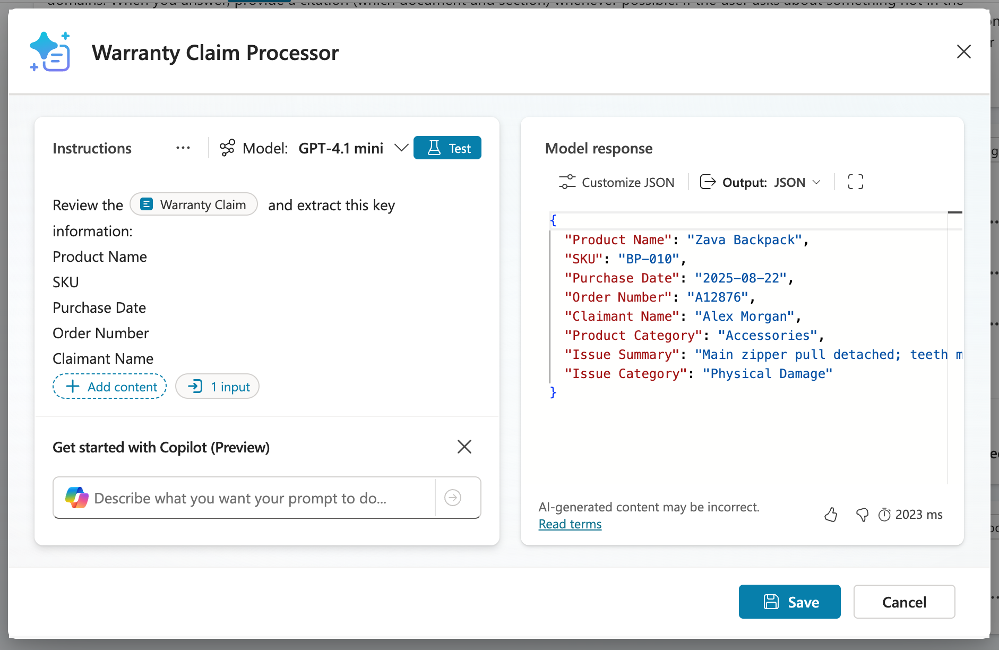

1. Now click the **Add and configure** button to add this to the agent and take you directly to the configuration page for the prompt.

    

1. Now we'll see the configuration screen where we can control specific settings for the prompt for use in our agent. The first thing we need to do is expand out the **Additional details** section and select the **Agent may use thsi tool at any time** radio button.

    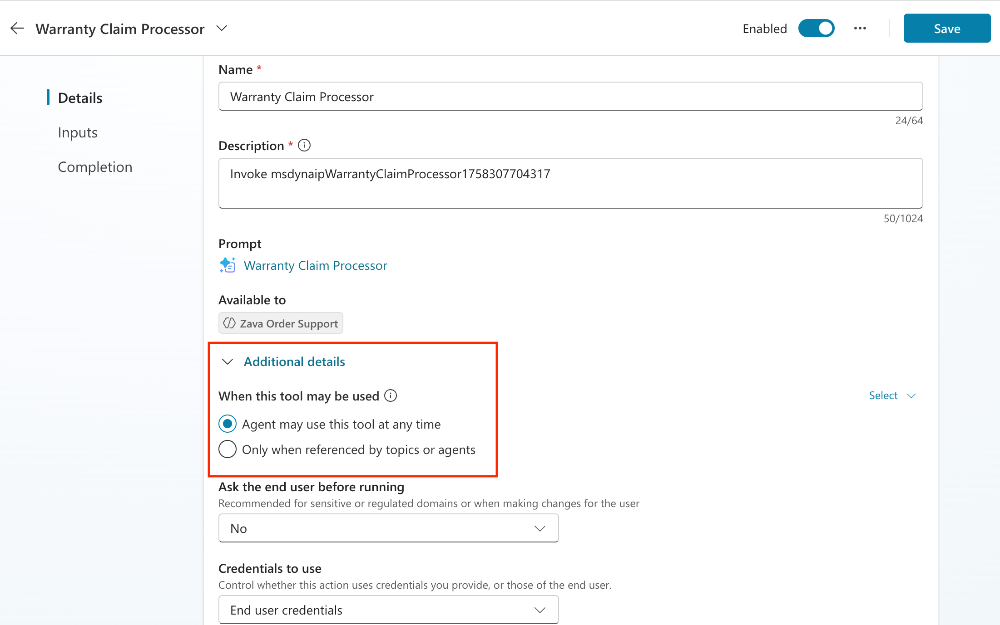

1. Next, scroll down to the Inputs section where you'll find the input you created in the prompt for warranty claim. There are two ways to fill this input: hard coding it or letting AI dynamically fill it. We want AI to dynamically fill it in this case, but we need to give it more details to know where to get that from and what it should do. To do that, click the **Customize** button next to the input.

    

1. In the **Description** box, paste the following:

```text
Fill with the details of the warranty claim pasted in the chat from the user.
```


1. Click the **Save** button to save all of your changes.

    

1. Select the **Overview** tab to go back to the overview screen.

    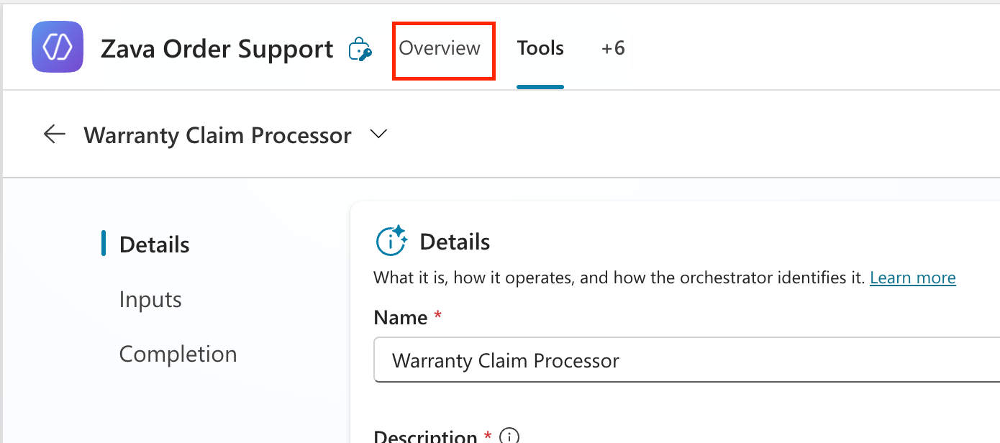

1. Now we need to modify the instructions so if someone asks for a warranty claim approval, it calls the prompt to extract information. To do this, select the **Edit** button next to the **Instructions** section.

    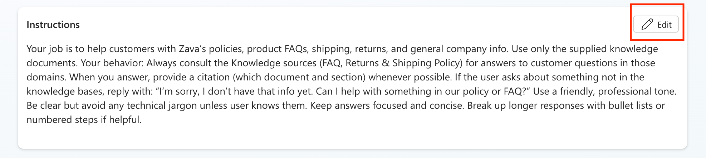

1. Paste in the following text below the instructions that are already in there.

    ```text
    If someone asks about doing a warranty claim review, call the [add prompt here] tool to extract the claim details. Look up the extracted product category in the Warranty Policy Knowledge source and extract the following information:
    
    Coverage Window
    Exceptions Allowed(Yes or No if the warranty claim has any exceptions that allow it to be approved outside the warranty period)
    Warranty Policy (full details of the warranty policy fo rthat given product category, example: receipts required, allowed within 30 days, etc)
    
    Respond in the chat with all relevant details that were extracted.
    ```


1. Delete the [add prompt here] text and replace with a forward slash (/). A menu will pop up where you'll see a **Tools** section. Expand that and select the **Warranty Claims Processing** prompt.

    

1. Click **Save** to save your new instructions.
1. Now it's time to test the end to end process.Click on the **Test** button in the upper right hand corner to open the Test Panel (if it isn't already open)
1. Paste in the following text in the test window:

    ```text
    Help me process this warranty claim from customer Chris Bailey (chris.bailey@example.com, +1 (555) 014-9932, prefers phone). Address: 55 N Greenwood Ave, Tulsa, OK 74120. The product is an Ergonomic Office Chair (SKU EOC-002, serial EOC002-77412) purchased from Zava Tulsa on 2024-08-10, order A11992. The issue: the chair slowly sinks about two inches over an hour—the pneumatic lift isn’t holding. This was noticed after a few months. The customer has a receipt and can provide photos.
    ```

    Press **Enter**


1. Watch the Activity Panel on the left hand side to see how the agent calls the prompt and passes in the information and does the check in the Warranty Policy knowledge source to find and return the necessary information.

    

You've just sucessfully added additional functionality to your agent to handle extracting warranty claim details using an AI Prompt. Now, we'll see how to improve this warranty claim review process by adding in an approval process.

## 4 - Add an Agent Flow for Approving Warranty Claims

Now that we have an AI prompt that can classify warranty claims and extract key info, we’re going to wrap this process in a formal, approval path based off of certain conditions like if it's in the warranty period. This is exactly what Agent Flows are for: augmenting your agents with a configurable and predictable decision path. In this section, you’ll build an agent flow that reads the extracted fields, evaluates the policy conditions, and triggers an auto approval if those conditions are met.

1. To create a new agent flow, scroll down to the Tools section and select **New Tool**
    

1. Select **New Tool** in the dialog

    

1. Select **Agent Flow**. This will route you to a new agent flow that you'll need to configure.

    

1. You'll see two items on the screen, the trigger which kicks off the flow and the response which returns data back to the agent. The first thing we need to do is configure any inputs that we want to pass into our flow from the agent to use in the flow. To add these inputs, select the **When an agent calls the flow** trigger.

    

1. Select **Add an input**

    

1. Select the **Text** option

    

1. In the Text input type ```Issue Category```

    

1. Select **Add an input**

    

1. Select the **Text** option

    

1. In the Text input type ```Purchase Date```

    

1. Select **Add an input**

    

1. Select the **Number** option

    

1. In the Text input type ```Coverage Window Days```

    

1. Select the **plus button** between the when an agent calls a flow and respond to agent.

    

1. Search for **variable** and select **initialize variable**

    

1. In the **Name** field type ```Approval Outcome```. And in the **Type** dropdown select **String**

    

1. Select the **plus button** again below the initialize variable action you just added

    

1. Search for **variable** and select **initialize variable**

    

1. In the **Name** field type ```Approval Message```. And in the **Type** dropdown select **String**

    

1. Select the **plus button** again below the initialize variable action you just added

    

1. Search for **variable** and select **initialize variable**

    

1. In the **Name** field type ```Days Since Purchase```. And in the **Type** dropdown select **Integer**

    

1. In the **Value** Input of the Initialize Variable, select the **Fx** Button.

    

1. Select the **Create Expression with Copilot** Button

    

1. In the box type the following:
```Calculate the number of days difference between the current date and the Purchase Date Input```

Select **Create Expression**


1. Verify the formula in the **Suggested expression** box and select the **OK** button.

    

1. Verify the formula is added to the expression box and select the **Add** button

    

1. Verify the expression shows in the value input as shown below and click the **Plus Button** below the initialize variable.

    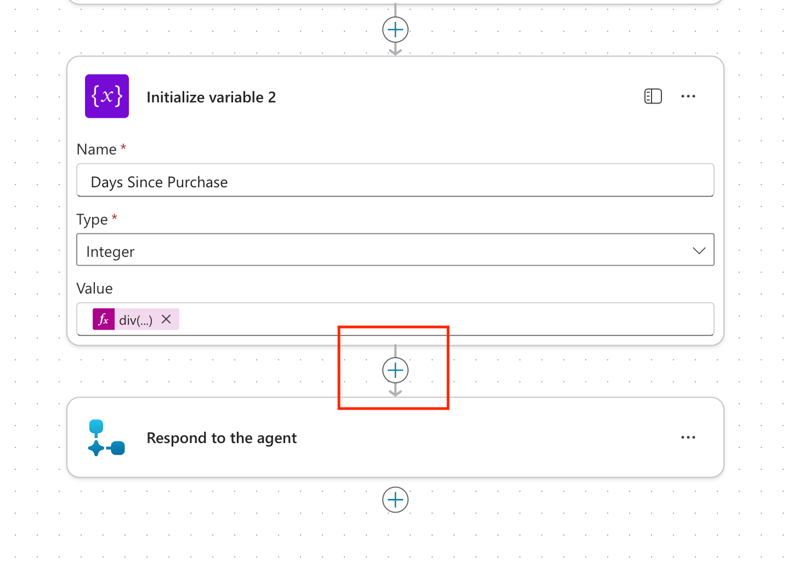

1. Search for ```condition``` and select **Condition** under the control header.

    

1. Now we need to fill out the conditions we want to check for. To do that, click in the first input and select the **lightning bolt** icon

    

1. Select the **Days Since Purchase** variable

    

1. Select the **is less or equal to** dropdown

    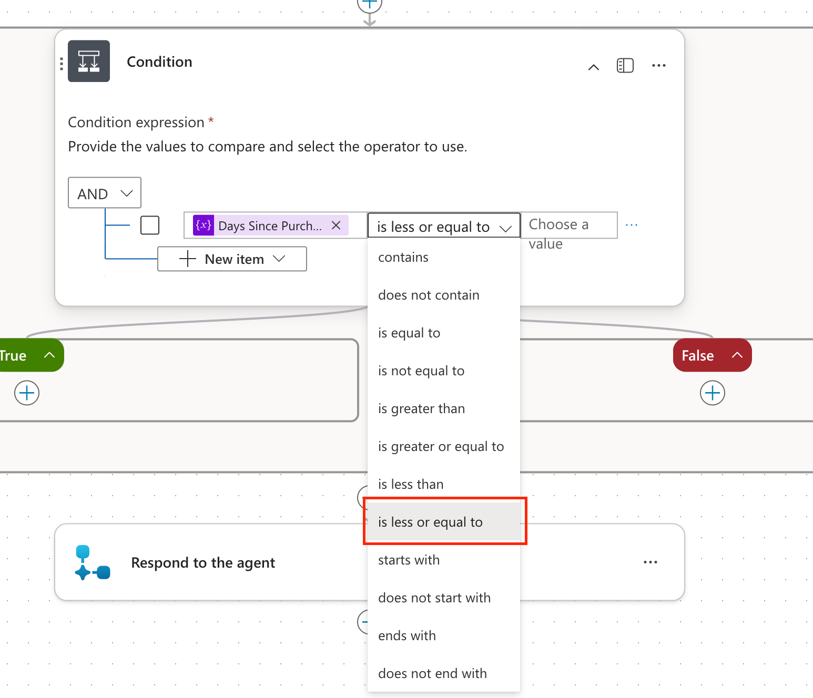

1. In the right text box select the **lightning bolt** icon.

    

1. Select the **Coverage Window** Variable

    

1. Your condition should look like the screenshot below. We need to add one more condtion to this. To do that, select the **New item** button.

    

1. Select **Add Row**

    

1. Select the **lightning bolt** icon in the left text input

    

1. Select the **Issue Category** variable.

    

1. Change the condition dropdown to **is not equal to**

    

1. In the right text input type ```Unknown```. Verify that your Condition action matches the screenshot below.

    

1. Now that we have our conditions we want to check for, we need to tell the flow what would happen if it meets those conditions and what to do if it doesn't. To do this, expand out the **True** dropdown and select the **Plus button**

    

1. Search for **variable** and select the **Set Variable** action.

    

1. In the **Name** Dropdown select the **Approval Outcome** variable.  In the **Value** input type ```Auto-Approved```. What we're doing here is for our process, we want to auto-approve any warranty claims that aren't unknown cateogry and are within the coverage window.

    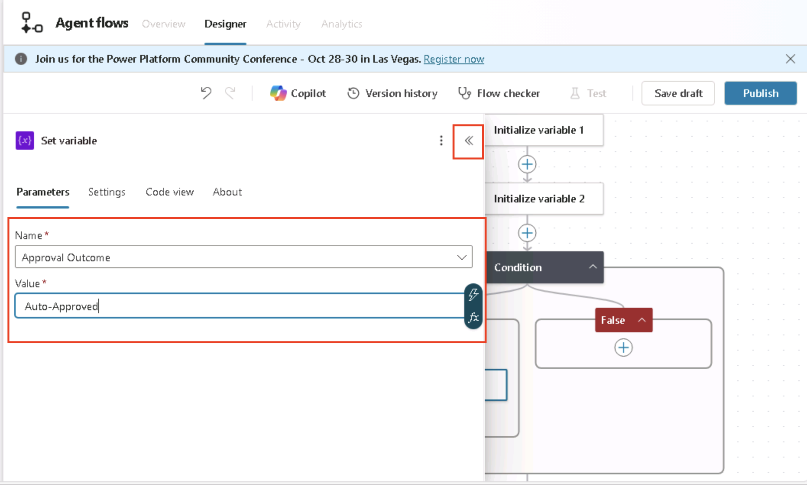

1. Now we want to fill in the approval notes. To do this, expand out the **True** dropdown and select the **Plus button**

    

1. Search for **variable** and select the **Set Variable** action.

    

1. In the **Name** Dropdown select the **Approval Message** variable.  In the **Value** input type ```The Warranty Claim has been reviewed and meets all requirements to be auto-approved```.

    

1. Now we need to tell the flow what to do if it doesn't meet these conditions. To configure this, expand the **False** section and select the **Plus Button**

    

1. Search for **variable** and select the **Set Variable** action.

    

1. In the **Name** Dropdown select the **Approval Outcome** variable.  In the **Value** input type ```Needs Exception Approval```. This will return back to the user informing them it couldn't be auto-approved and escalation is needed.

    

1. Now we want to fill in the approval notes. To do this, expand out the **True** dropdown and select the **Plus button**

    

1. Search for **variable** and select the **Set Variable** action.

    

1. In the **Name** Dropdown select the **Approval Message** variable.  In the **Value** input type ```The Warranty Claim has been reviewed and it is not within the approved warranty policy guidelines. You can request a review for an exception if you'd like.```.

    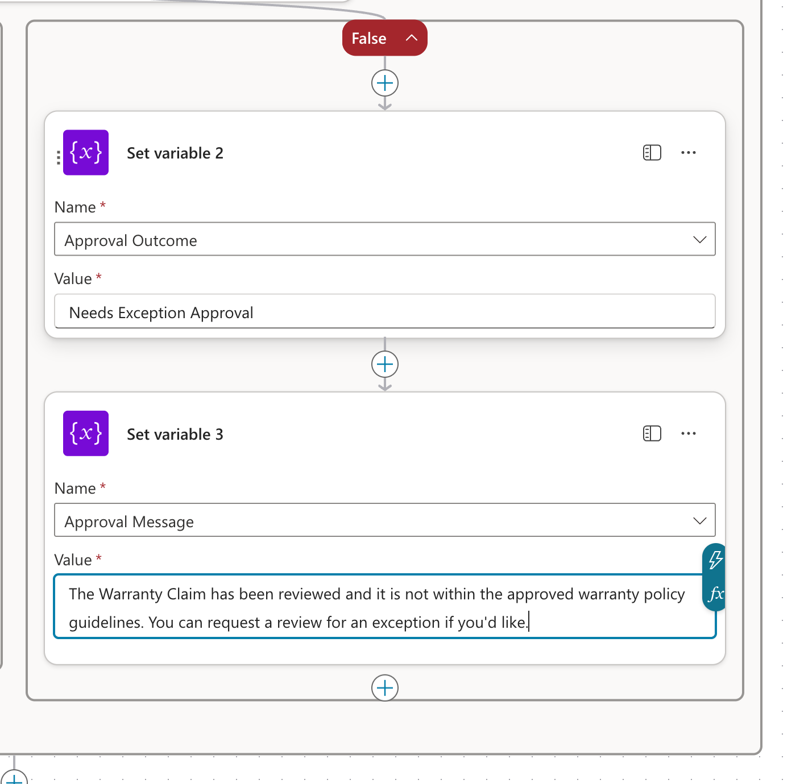

1. We are in the home stretch now. All that's left is to pass the data of the approval outcome back to the agent. To do that, scroll to the bottom and click to expand the **Respond to the agent** action and select the **Add an output** button

    

1. Select **Text** for the output type

    

1. Type ```Approval Outcome``` in the left text box. Click in the right text box and select the **lightning bolt** icon

    

1. Select the **Approval Outcome** variable

    

1. Select **Add an Output** again

    

1. Select **Text** as the Output Type

    

1. Type ```Approval Notes``` in the left text box. Click in the right text box and select the **Lightning bolt** icon.

    

1. Select the **Approval Message** variable

    

1. Select the **Flow Checker** button to test your flow for errors and ensure no errors are found.

    

1. Select the **Save Draft** button

    

1. Select the **Overview** button in the top navigation

    

1. Select the **Edit Button** in the Details section

    

1. Change the **Flow Name** to **Auto Approval Claims**. Put in ```This agent flow evaluates a warranty claim against a condition to determine if it's eligible for auto-approval or needs escalation and returns a response to the agent.``` for the description and click the **Save** button.

    

1. Select the **Designer** tab in the top navigation to go back to the designer view.

    

1. Select the **Publish** button

    

1. Select the **Agents** tab in the left hand side to get back to your agent.

    

1. Select the **Zava Order Support** Agent

    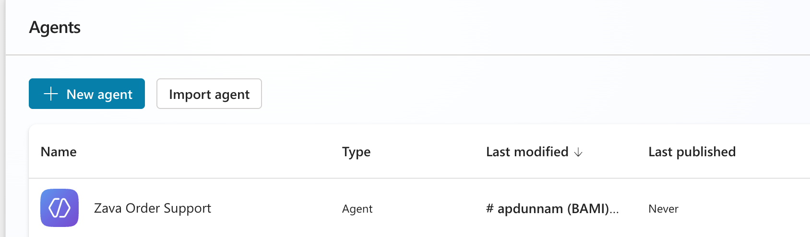

1. Scroll down to the **Tools** section and select the **Add tool** button

    

1. Select the **Flow** tab

    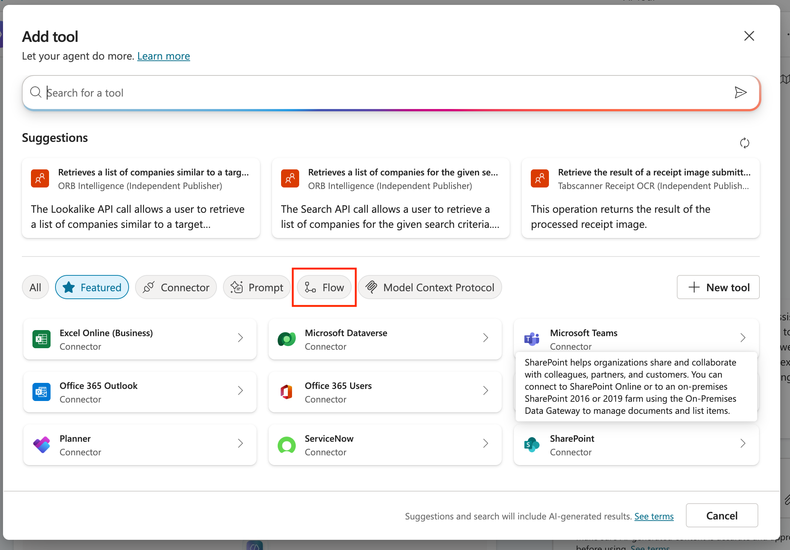

1. Select the **Auto Approval Claims** flow from the list

    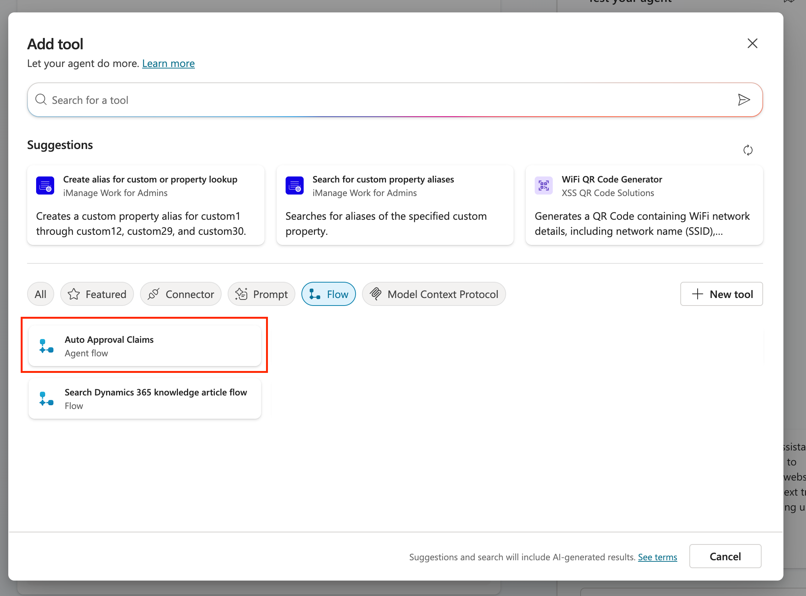

1. Select the **Add and Configure** button

    

1. Select the **Additional Details** section and select the **Agent may use this tool at any time** radio button.

    

1. Now we need to give additional details for how AI should pass the required inputs to the flow. To do this, scroll down to the **Inputs** section and select the **Customize** button next to the **Issue Category** input.

    

1. Type ```Fill with the issue category extracted from the Claims Processing Tool``` in the Description box

    

1. Select the **Customize** button next to the **Purchase Date** input.

    

1. Type ```Fill with the Purchase Date extracted from the Claims Processing Tool``` in the Description box

    

1. Select the **Customize** button next to the **Coverage Window Days** input.

    

1. Type ```Fill with the numeric (in days) value of the Coverage Window extracted from the Warranty Policy``` in the Description box

    

1. Scroll down to the **Completion** section and select the **Write the response with generative AI** option from the **After Running** dropdown

    

1. Select the **Save** button

    

1. Select the **Overview** tab

    

1. Select the **Instructions** section and select the **Edit** button

    

1. Remove the last line about "respond in chat...". Type ```After all of the data is extracted, call the``` and put a forward slash (/) so the tool selection screen comes up and select the **Claim Approval** tool.

    

1. Finish drafting the additional instructions by pasting in the following after the tool selection:
```tool. Pass all the required info and return the approval outcome for the warranty claim and approval message to the user to finish the process. Inform the user that an approval process has been started and an answer should be given shortly while you are waiting for the approval to process.```.

Select the **Save** button in the instructions section when done.


You've just added an agent flow to handle warranty claim auto-approvals to your agent! Now all that's left to do is test.

===

## 5 - Test Your Agent

Now that you've got the agent fully configured, it's time to test.

1. Ensure that the **Test** button is selected and the Test pane shows. Type the following in the test window and press **Enter** to send in the prompt:

```Help me process a warranty claim for customer Alex Morgan. Address: 123 Maple Lane, Tulsa, OK 74104. Product: Zava Backpack (SKU BP-010) purchased from Zava Online on 2025-08-22, order A12876. After two commutes the main zipper pull detached; the teeth misalign and the main compartment won’t close. Used under normal conditions.```


1. Watch the Activity Pane and notice how the agent calls the Warranty Claim Processor Prompt, pulls in knowledge and calls the flow. Since it's using generative AI, your response may vary. The important thing is to confirm you see the **Auto Approval Claims** action get called in the Activity Map and you get a response. Feel free to test a different scenario where the purchase date is not within the warranty period, say 2024-09-30, and verify that you get a different outcome.

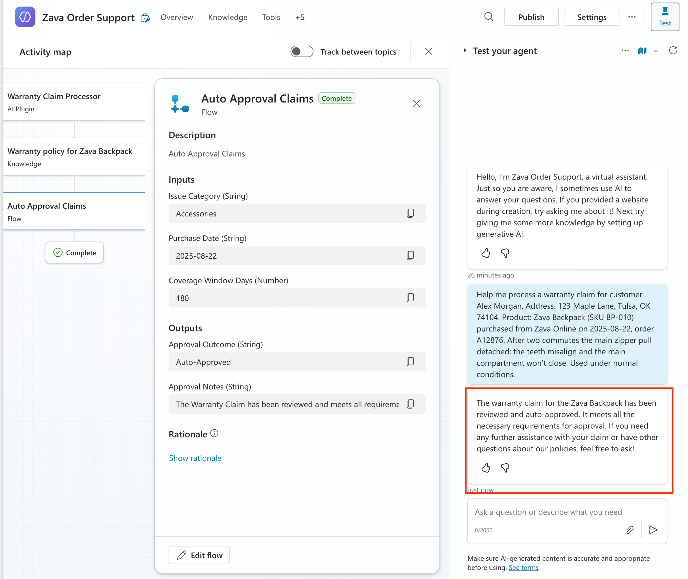

Congratulations! You’ve now built and tested a Order Management Agent in Copilot Studio that can pull from knowledge, consume and write to internal data through MCP and integrates with AI Prompts and Agent Flows.

===

Nothing will be graded so feel free to submit and close out of the VM. If you finished the workshop you get an A+!
